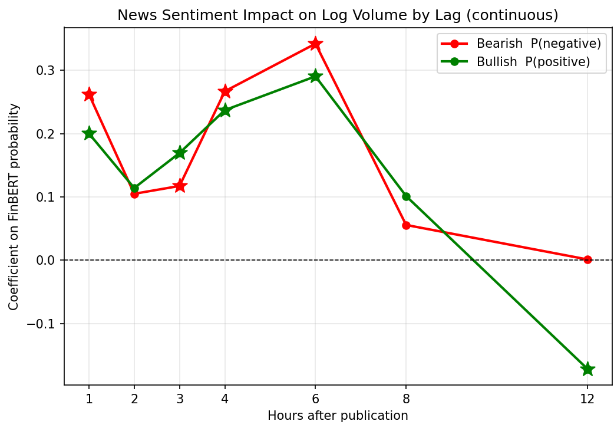
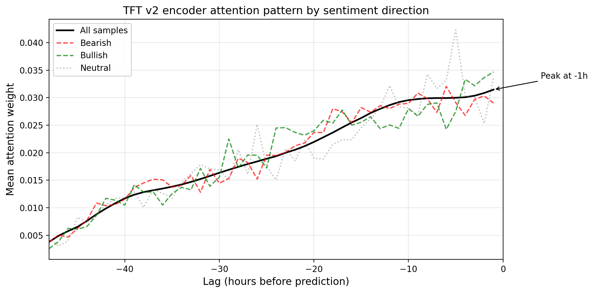

<!-- _class: cover -->
<!-- _paginate: false -->

# News-Driven Liquidity Dynamics in WTI Crude Oil Futures: A Channel Decomposition Approach

<div class="meta">

Enrique Favila Martinez
S1173176

Supervisor: Prof. Dr. Lejla Batina
Second reader: Prof. Dr. Tom Heskes
Radboud University, Faculty of Science

</div>

---

## NEWS AND MARKETS

# THE MOTIVATION

**News moves markets. The open question is when.**

- Most media sentiment predicts price pressure and trading volume at **daily** resolution.
- The reaction to a release is concentrated within **minutes to hours**. _A daily bar averages that away._

**Why WTI?**

- **Superb news coverage.**
  - EIA inventories every Wednesday 10:30 ET
  - OPEC+ decisions
  - macro releases.
- **Deep enough to measure hourly.** Real volume in every trading hour, so an hourly liquidity measure is signal rather than noise.

---

## RESEARCH QUESTIONS

# WHAT WE WANT TO KNOW

### RQ1. Lag structure

At what lag does news sentiment exert its **strongest** effect on WTI trading liquidity?

### RQ2. Directional asymmetry

Does the liquidity response differ between bearish and bullish news?

_Liquidity_ is measured by **log trading volume** (activity), the **Amihud ratio** (price impact), and the **Parkinson range** (volatility).

---

<!-- _class: section -->

## PHASE 1

# AN INTERPRETABLE BASELINE

---

## PHASE 1 · DATA

# THE MARKET DATA

**Hourly: Open, High, Low and Close price of each hour, plus the Volume traded, from Yahoo Finance**

<div class="cols">
<div class="col">

**What we pull**

- `CL=F`: WTI front-month futures
- `DX-Y.NYB`: US Dollar Index
- `^VIX`: CBOE Volatility Index

_DXY and VIX enter as controls in Phase 2._

</div>
<div class="col">

| From      | We derive               | Measures     |
| --------- | ----------------------- | ------------ |
| Volume    | `log_volume`            | **activity** |
| High, Low | `price_range`           | volatility   |
| Close     | `log_return` → `amihud` | price impact |

_Open is never used._

</div>
</div>

</br>

- `log_volume` counts how much was traded, so it measures raw activity.
- `amihud` divides the size of the price move by the volume behind it, so it measures how hard the price is to push: a small move on heavy trading means a liquid hour.
- `price_range` is the high-to-low spread within the hour, a fast proxy for volatility. Together they capture activity, price impact and volatility.

---

## PHASE 1 · DATA

# THE NEWS DATA

**News from GDELT from March 2024 - March 2026.**

<div class="cols">
<div class="col">

| News Stage                     | Articles   |
| ------------------------------ | ---------- |
| Raw GDELT records              | 51,948     |
| After dedup and English filter | 16,326     |
| Substantive bodies             | 7,755      |
| Title-only fallback            | 5,935      |
| **Phase 1 modelling set**      | **13,690** |

</div>
<div class="col">

**The eight queries**

```text
crude oil market
OPEC production cut
oil supply demand
petroleum inventory
Brent crude price
oil inventory report
energy market outlook
crude oil WTI price
```

</div>
</div>

</br>

- Regex filter: keyword list plus a minimum length.
- March 2024 to March 2026, aligned to **11,219** hourly WTI records.

---

## PHASE 1 · FEATURES

# HOW FINBERT PROCESSED THESE ARTICLES

**Each article is scored twice: on the title alone, then on the title plus body.**

<div class="cols">
<div class="col">

- **BERT fine-tuned on financial text** (Araci, 2019), the de facto baseline in financial NLP.
- Domain-adapted, so it reads financial language better than general-purpose sentiment tools.
- Fine-tuned on **339,750** corporate and financial documents.
- Returns three probabilities per article:
  _P(pos), P(neu), P(neg)_.

- FinBERT scores **tone**, not price direction.

</div>
<div class="col">

**Processing title vs title + body gave different results**
_"Oil up 4pc for the week after solid demand forecasts"_

| Input        | P(pos)   | P(neu) | P(neg)   |
| ------------ | -------- | ------ | -------- |
| Title only   | **0.93** | 0.03   | 0.03     |
| Title + body | 0.02     | 0.01   | **0.97** |

This is one of the most radical cases that motivates the headline bias experiment.

</div>
</div>

---

## PHASE 1 · A SIDE EXPERIMENT

# HEADLINE BIAS: TITLES ARE NOT ARTICLES

**Where each title label ends up once the body is read** (7,755 articles with a body):

| Title label      | → positive  | → neutral | → negative    |
| ---------------- | ----------- | --------- | ------------- |
| positive (2,427) | 1,437 (59%) | 264 (11%) | **726 (30%)** |
| neutral (2,257)  | 676 (30%)   | 688 (31%) | **893 (40%)** |
| negative (3,071) | 500 (16%)   | 169 (6%)  | 2,402 (78%)   |

</br>

**3,228 articles (41.6%) change label**, and the movement is one-directional: positive and neutral titles leak into negative far more than negative titles leak out.

In short, **a headline reads more positive than the article it introduces.**

For phase 1, I decided to use the whole set of news, accepting this trade-off, since it serves as a guide that leads to phase 2.

---

## PHASE 1 · ALIGNMENT

# PINNING NEWS TO TRADING HOURS

**News publishes at any hour. Trading does not.**

<div class="cols">
<div class="col">

**Ceiling rule**

| 13:00 |    14:00     |    15:00     | 16:00 |
| :---: | :----------: | :----------: | :---: |
|       | news 14:23 → | **assigned** |       |

_The 14:00 bar was already forming before the news existed._

</div>
<div class="col">

**Forward-assignment**

| Sat 11:40 | weekend |  Sun 22:00   |
| :-------: | :-----: | :----------: |
|  news →   | closed  | **assigned** |

_Off-hours news waits for the reopen instead of being dropped._

</div>
</div>

<div class="cols">
<div class="col">

**Total of articles aligned: 13690**
| Publication-to-hour gap | Articles | Share |
| ----------------------- | -------- | --------- |
| contemporaneous (< 2h) | 11,316 | **82.7%** |
| forward-assigned (≥ 2h) | 2,374 | 17.3% |

</div>
</div>

---

## PHASE 1 · THE METHOD

# ORDINARY LEAST SQUARES (OLS)

**Article text → FinBERT → Softmax over three classes → Two of the three become the regressors**

$$\mathrm{log\ volume}_{t+k} = \beta_0 + \beta_1 P(\mathrm{neg})_t + \beta_2 P(\mathrm{pos})_t + \varepsilon_t$$

<div class="cols">
<div class="col">

| Term                    | Definition                             |
| ----------------------- | -------------------------------------- |
| `log_volume` at t+k     | what we predict, k hours later         |
| `P(neg)`, `P(pos)` at t | FinBERT softmax scores at publication  |
| β₁, β₂                  | **the answer** we read off             |
| β₀                      | fitted intercept: a fully neutral hour |
| ε                       | everything else moving volume          |

News is one driver of hourly volume among **many**, and here we are not chasing predictive power.
The finding is the **shape across lags**.

</div>
<div class="col">

**Three design choices**

- **Keep the probabilities.** A 0.95-bearish article should count for more than a 0.51-bearish one.
- **One coefficient per direction (β₁, β₂).** A single sentiment score would force bearish and bullish to have equal and opposite effects. In reality both raise volume, by different amounts, and that difference is what RQ2 measures.
- **One regression per lag.** Eight separate fits, k ∈ {0, 1, 2, 3, 4, 6, 8, 12}, so we can watch the effect rise and fade.

</div>
</div>

---

## PHASE 1 · RESULTS

# THE RESPONSE PEAKS AT +6 HOURS

<div class="cols">
<div class="col">



</div>
<div class="col">

**RQ1 · The lag**

Builds from publication `t = 0`, peaks sharply at **+6h**, gone by +8h.

Peak β = 0.342. Volume is logged, so the effect is e^β − 1 ≈ **41% more volume** than a neutral hour.

**RQ2 · Asymmetry**

Bearish sits above bullish at 0, +1h, +4h and +6h, by ≈ **18%** at the peak. Exception: +3h, where both are small and bullish is slightly higher.

A coefficient **below zero** means _less_ volume than a neutral hour. The bullish line drops there at +12h (≈ 16% less), an isolated point the findings do not rest on.

</div>
</div>

---

## PHASE 1 · LIMITATIONS

# WHAT THIS BASELINE COULD NOT DO

</br>

- **One sentiment axis.** Three classes only: no magnitude, event type, entities or certainty. _News carry more information than sentiment._
- **A lexical filter.** A regex filter that keeps long off-topic text and rejected short substantive news.
- **A sparse, event-driven signal.** Roughly half of all hours carry no news. The regression works around that by looking at one article at a time, so it never learns from the market's own recent history.
- **No macro controls.** Hourly volume moves for many reasons other than news.
- **Pre-war data only.** The corpus stops at the war onset, 28 February 2026.

</br>
</br>

**Each of these sets one task for Phase 2.**

---

<!-- _class: section -->

## Phase 2

# Richer features, expressive model

---

## PHASE 2 · CHANGES NEEDED

# TARGETING LIMITATIONS FROM PHASE 1

- **Get more data.** Extend the corpus past February 2026, and add macro controls so news is not carrying variance it never owned. Add existing conflict to the news corpus.
  </br>

- **Extract richer features.** Replace three sentiment classes with a structured schema from a LLM.
  </br>
- **Calibrate that extraction.** Have a more reliable way to verify the content of the news. We have no human annotated ground truth.
  </br>
- **Change the model.** Sparse, event-driven news with many features and several horizons needs more than a single-lag regression.

---

## PHASE 2 · NEW DATA

# WHAT WE CHANGED ABOUT THE INPUTS

<div class="cols">
<div class="col">

| Changes         | Phase 1     | Phase 2             |
| --------------- | ----------- | ------------------- |
| Queries         | 8           | **13**              |
| Unique articles | 16,326      | **22,795**          |
| Window ends     | March 2026  | **May 2026**        |
| War onset       | not covered | **inside the data** |
| Macro controls  | none        | **DXY, VIX**        |

</div>
<div class="col">

**The five new queries**

```text
Iran sanctions oil
Saudi Arabia oil production
China oil demand
Russia oil exports
oil supply disruption
```

</div>
</div>

- **Why macro controls.** Phase 1 explained under **0.3%** of hourly volume. Letting the model absorb broad market movement leaves a cleaner residual for news.
- **Why the longer window.** The 28 February 2026 war onset now sits inside the data, which is what makes a regime test possible at all.

---

## PHASE 2 · EXTRACTION

# THE EXTRACTION SCHEMA

**Detected:** one score, two judgments. _Good or bad news?_ vs _price up or down?_ On supply threats they point opposite ways.

**Fixed:** three separate channels. `price_direction` dropped, `event_type` ordered, `usable` required.

_"Russian Sanctions Drive Oil Prices Higher"_

<div class="cols">
<div class="col">

**Schema v1**

```json
{
  "sentiment_score": 0.75,
  "magnitude": 0.85,
  "price_direction": "bullish",
  "event_type": "geopolitical",
  "certainty": 0.9,
  "time_horizon": "short_term",
  "entities": ["Russia", "US", ...]
}
```

</div>
<div class="col">

**Schema v2**

```json
{
  "usable": true,
  "sentiment_score": 0.85,
  "supply_impact": -0.9,
  "demand_impact": 0.0,
  "risk_premium": 0.8,
  "magnitude": 0.85,
  "certainty": 0.9,
  "event_type": ["geopolitical", "supply"],
  "time_horizon": "short_term",
  "entities": ["United States", ...]
}
```

</div>
</div>

---

## PHASE 2 · DATA VALIDATION

# THE COMPOSITE SENTIMENT FAILED, SO WE DECOMPOSED IT

**No human ground truth.** So: cross-model agreement. Same 30 articles, scored by Claude Haiku and by OpenAI GPT-5.

| Metric                                             | v1 schema    | v2 schema          |
| -------------------------------------------------- | ------------ | ------------------ |
| `sentiment_score` correlation                      | 0.39         | **0.88**           |
| Sign disagreements                                 | 4 / 13 (31%) | **1 / 14 (7%)**    |
| `supply_impact` / `demand_impact` / `risk_premium` | —            | 0.94 / 0.96 / 0.82 |

**Where it broke:** geopolitical events, the highest-magnitude articles in the sample.

**The surprise:** the composite improved from 0.39 to 0.88 **without being modified**.
Decomposing first disciplines everything downstream.

---

## PHASE 2 · TEMPORAL FUSION TRANSFORMER (TFT)

# SETTING THE INPUTS

**Why a TFT:** it learns nonlinear interactions a single-lag regression cannot, and it reports its own reasoning: which inputs it weighted, and which past hours it looked at. **Exactly what we need.**

<div class="cols">
<div class="col">

**Aggregating articles to the hourly grid**

- Continuous features: hour-averaged
- Entity flags: maximum count
- Categoricals: highest-magnitude article
- Hours with no news: `no_news`

**71 canonical entity flags.** "Tehran" and "Iranian" both map to `ent_iran`.

`event_type` and `time_horizon` as **learned embeddings**, not integer codes.

</div>
<div class="col">

**TFT v2, selected by ablation**

|           |                                       |
| --------- | ------------------------------------- |
| Encoder   | 48 hours                              |
| Targets   | `log_volume`, `amihud`, `price_range` |
| Horizons  | +1, +3, +6, +12h                      |
| Split     | 60 / 20 / 20                          |
| War onset | inside the **test** set               |

</div>
</div>

---

## PHASE 2 · PREDICTIONS

# PREDICTION AGAINST A PERSISTENCE BASELINE

**Persistance baseline:** hourly volume is strongly autocorrelated, so "assume nothing changes" is already a good forecast. Beating it means the model has learned more than inertia.

<div class="cols">
<div class="col">

**Reduction vs persistence**

| Target        | +1h  | +3h  | +6h  | +12h     |
| ------------- | ---- | ---- | ---- | -------- |
| `log_volume`  | +46% | +60% | +67% | **+71%** |
| `amihud`      | +43% | +43% | +45% | +45%     |
| `price_range` | −45% | −24% | −14% | −3%      |

</div>
<div class="col">

**`log_volume` MAE, validation vs test**

|      | val   | test  |
| ---- | ----- | ----- |
| +1h  | 0.530 | 0.585 |
| +3h  | 0.534 | 0.577 |
| +6h  | 0.542 | 0.602 |
| +12h | 0.557 | 0.631 |

</div>
</div>

**Works.** Volume and Amihud beat persistence at every horizon, and the margin **grows with the horizon**.

**Fails.** `price_range`, but only in the war regime. Pre-war it **beats** persistence (0.15 against 0.18 to 0.28).

**Why:** trained on moderate volatility, the model reverts to the mean in a regime it never saw. A clean regime-extrapolation failure.

---

## PHASE 2 · RESULTS FOR RQ1

# WHERE IN TIME THE MODEL LOOKS

<div style="text-align:center">



</div>

---

## PHASE 2 · VARIABLE SELECTION NETWORK (VSN)

# WHAT THE MODEL PAYS MORE ATTENTION TO

<div class="cols">
<div class="col">

| #   | Feature           | Weight |
| --- | ----------------- | ------ |
| 1   | `vix`             | 0.188  |
| 2   | `supply_impact`   | 0.121  |
| 3   | `ent_oman`        | 0.113  |
| 4   | `demand_impact`   | 0.055  |
| 5   | `is_wednesday`    | 0.022  |
| 6   | `ent_japan`       | 0.017  |
| 7   | `ent_eu`          | 0.016  |
| 8   | `ent_iran`        | 0.015  |
| 9   | `ent_china`       | 0.014  |
| 10  | `ent_algeria`     | 0.014  |
| 21  | `sentiment_score` | 0.009  |

</div>
<div class="col">

**Entities carry the block.** All 71 flags together hold **52%** of total importance, and six sit in the top ten.

**Only four features lead individually.** VIX, supply, Oman, demand. Everything from rank 5 down is **≤ 0.022**.

**Channels rival VIX.** Supply plus demand carry **17.6%**, against 18.8% for VIX alone.

**Wednesday matters.** EIA inventory release day.

**The composite sinks to 21st.** Decomposing sentiment showed what is more important.

_Exact ranks shift on retraining. What was stable is the feature type: risk and salience over price direction._

</div>
</div>

---

<!-- _class: section -->

# What we can learn from this?

---

## DISCUSSION

# ANSWERING THE TWO RQS

<div class="cols">
<div class="col">

### RQ1 · Settled twice

**The response lands at +6 to +12h.**

- Lag OLS peaks at **+6h**
- TFT attention peaks at **−6h** for bearish
- The two methods share no assumptions

_Gradual, not instantaneous._

</div>
<div class="col">

### RQ2 · Real, if stated precisely

**Asymmetry is marginal, not average.**

- Phase 1: bearish sensitivity **>** bullish
- Phase 2: 16 tests of mean volume, **null**
- Different quantities, not a failed replication

_The model leans on risk and salience, not direction._

</div>
</div>

---

## DISCUSSION

# LIMITATIONS AND WHAT COMES NEXT

<div class="cols">
<div class="col">

### Limitations

- **No human ground truth.** Model agreement with only 30 samples.
- **`price_range`** breaks at the regime boundary.
- **Narrow scope.** One commodity, two years, one structural break.
- **Public web corpus**, not the institutional feeds traders read.

</div>
<div class="col">

### Next steps

- **An expert anchor set** of ~200 articles, to calibrate the calibration.
- **Carry both sentiments.** Tone and price impact in parallel; their disagreement may itself be signal.
- **Multi-regime training.**
- **Cross-commodity replication**, starting with natural gas.

</div>
</div>

---

<!-- _class: section -->

## MAIN FINDING

# LIQUIDITY RESPONDS TO RISK, NOT SENTIMENT DIRECTION

The market does not trade more because the news is bad. It trades more because the news raises uncertainty about supply.
In petrol oil, that uncertainty is often against intuition, bullish for price.
