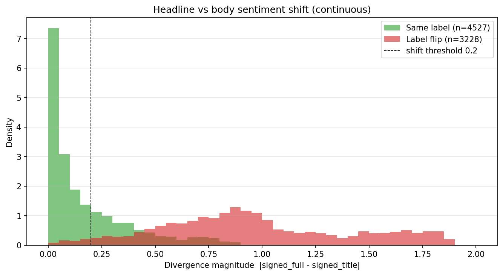
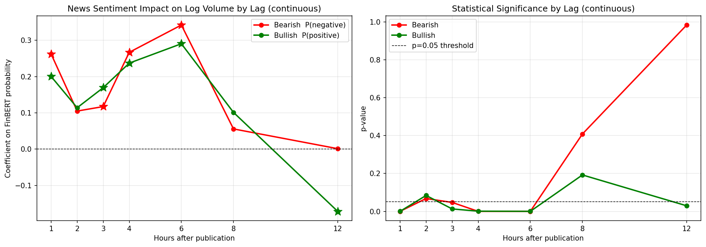

<!-- _class: cover -->
<!-- _paginate: false -->

# News-Driven Liquidity Dynamics in WTI Crude Oil Futures

<div class="meta">

Enrique Favila Martinez
S1173176

Supervisor: Prof. Dr. Lejla Batina
Second reader: Prof. Dr. Tom Heskes
Radboud University, Faculty of Science

</div>

---

## NEWS AND MARKETS

# THE RESOLUTION GAP

**News moves markets. The open question is when.**

- Media sentiment predicts price pressure and trading volume (Tetlock, 2007), but almost all of that work is at **daily** resolution.
- The reaction to a release is concentrated within **minutes to hours** (Ederington & Lee, 1993). A daily bar averages that away.
- WTI is a good place to look: OPEC policy, geopolitics, the weekly EIA release and macro announcements all arrive at a **known** time, in a deeply liquid market.
- Kilian & Vega (2011) find **no** response of daily energy prices to daily macro news.

**A null at daily frequency does not rule out an effect at hourly frequency.**

---

## RESEARCH QUESTIONS

# WHAT WE ASK

### RQ1. Lag structure

At what lag, if any, does news sentiment exert its strongest effect on WTI trading liquidity?

### RQ2. Directional asymmetry

Does the liquidity response differ between bearish and bullish news, and if so, in what sense?

Liquidity is measured by **log trading volume** (activity), the **Amihud ratio** (price impact), and the **Parkinson range** (volatility). Two phases answer these: an interpretable baseline, then a richer model that corroborates it.

---

<!-- _class: section -->

## PHASE 1

# An interpretable baseline

---

## PHASE 1 · DATA

# THE DATA COLLECTED

**News from GDELT, market data from Yahoo Finance, on a common hourly grid.**

| Stage                                            | Articles   |
| ------------------------------------------------ | ---------- |
| Raw GDELT records, eight oil-market queries      | 51,948     |
| After deduplication and English filter           | 16,326     |
| Body retrieved (~80% success) and regex-filtered | 7,756      |
| Title-only fallback where the body failed        | 5,934      |
| **Phase 1 modelling set**                        | **13,690** |

- Filter used here is regex with a set of words plus minimum text length
- Window: March 2024 to February 2026, against **11,219** hourly WTI records.

---

## PHASE 1 · FEATURES

# HOW FINBERT PROCESSED THESE ARTICLES

**FinBERT is a BERT variant fine-tuned on 339,750 individual corporate and financial documents.
It is applied to the articles only, never to market data.**

- Each article is scored **twice**: on the **title alone**, and on the **title plus body** (truncated to 512 tokens, title kept at the front).
- The model returns three class probabilities per article: _P(positive), P(neutral), P(negative)._
- **We keep the probabilities, not the argmax label:** a 0.95-bearish article should not count the same as a 0.51-bearish one.

One real article, _"Oil up 4pc for the week after solid demand forecasts"_:

| Input        | P(positive) | P(neutral) | P(negative) | Label    |
| ------------ | ----------- | ---------- | ----------- | -------- |
| Title only   | **0.93**    | 0.03       | 0.03        | positive |
| Title + body | 0.02        | 0.01       | **0.97**    | negative |

---

## PHASE 1 · A NON RELATED CONTRIBUTION

# HEADLINE BIAS: TITLES ARE NOT ARTICLES



Scoring the same article twice isolates the input: **41.6%** of articles flip label, and the mean signed shift is **−0.09**. Headlines lean _more bullish_ than the articles beneath them. For phase 1, title and title + body articles are considered.

---

## PHASE 1 · ALIGNMENT

# PINNING NEWS TO TRADING HOURS

**News publishes at any hour. Trading does not.**

- **Ceiling rule.** An article at 14:23 is assigned to the **15:00** bar, never 14:00. The 14:00 bar was already forming before the news existed, so using it would let news explain a candle that predates it.
- **Forward-assignment.** Off-hours news (overnight, weekends, OPEC announcements) are carried to the next available trading hour rather than dropped. It is the most market-moving subset of the corpus.
- The gap between publication and assigned hour is kept as a control, separating _contemporaneous news (< 2h)_ from _forward-assigned news (≥ 2h)_.

---

## PHASE 1 · THE METHOD

# ORDINARY LEAST SQUARES (OLS)

A regressional model was used for phase 1:

$$\mathrm{log\ volume}_{t+k} = \beta_0 + \beta_1 P(\mathrm{neg})_t + \beta_2 P(\mathrm{pos})_t + \varepsilon_t$$

- **Why ordinary least squares.** Nothing to tune and nothing to overfit: each $\beta$ reads directly as the volume response to a maximally confident article. Neutral is the omitted reference, since the three probabilities sum to one.
- **Two coefficients, not one signed score.** A single signed regressor would force $\beta_1 = -\beta_2$, assuming the response is symmetric. Whether it is symmetric is exactly RQ2.
- **One regression per lag,** $k \in \{0,1,2,3,4,6,8,12\}$, traces the effect over time. If news propagates with delay, the coefficients should **rise to a peak, then decay**, which is exactly what we need for RQ1.
- **What it cannot do.** $R^2$ will be small: news is _one driver_ of hourly volume among many. The finding is the _pattern_ across lags, not the fully explained variance.

---

## PHASE 1 · RESULTS

# THE RESPONSE PEAKS AT +6 HOURS



**RQ1:** the effect builds, peaks sharply at **+6h** (≈ 41% more volume than a neutral hour), and decays to insignificance by +8h. **RQ2:** bearish exceeds bullish at the dominant lags (0, +1h, +4h, +6h), by ≈ 18% at the peak. The exception is the weak +3h lag, where both coefficients are small and bullish is marginally higher.

---

## PHASE 1 · LIMITATIONs

# WHAT THIS BASELINE COULD NOT DO

- **One sentiment axis.** Three classes, with no magnitude, event type, entities, or certainty.
- **A lexical filter.** The regex accepted long off-topic text and rejected short substantive briefs.
- **A sparse signal.** Over half of all hours carry no news; an exploratory VAR by consequence could not identify anything with significative precision and was abandoned.
- **No macro controls** such as dollar and VIX, and **pre-war data only** (the corpus stopped in February 2026).

**Each of these drives a specific Phase 2 change.**

---

<!-- _class: section -->

## Phase 2

# Richer features, expressive model

---

## PHASE 2 · CHANGES NEEDED

# TargetING limitations from previous phase

**Each limitation of the baseline sets one new task.**

- **Get more data.** Extend the corpus past February 2026, and add macro controls so news is not carrying variance it never owned.
- **Extract richer features.** Replace three sentiment classes with a structured schema from an LLM.
- **Calibrate that extraction.** With no human ground truth, check it across model families before trusting it.
- **Change the model.** Sparse, event-driven news with many features and several horizons needs more than a single-lag regression.

**The next slides take these in order.**

---

## PHASE 2 · NEW DATA

# WHAT WE CHANGED ABOUT THE INPUTS

**Three changes before any modelling.**

- **A bigger corpus.** Five new queries (Iran sanctions, Saudi production, China demand, Russia exports, supply disruption) and a re-scrape up to May 2026: **22,795 articles**, now spanning the 28 February 2026 making emphasis on war onset, huge factor on oil liquidity this year.
- **Macro covariates.** Dollar Index (DXY) and Volatility Index (VIX) added as hourly controls. The Phase 1 regression explained under **0.3%** of volume variance, so letting the model absorb broad market movement leaves a cleaner residual for news.
- **Richer news features**. Using an LLM to extract features of news, using a schema v1, cross-calibrating against other LLM, then creating the schema v2.

---

## PHASE 2 · EXTRACTION

# THE EXTRACTION SCHEMA

Both extractions of _"Russian Sanctions Drive Oil Prices Higher"_, before and after the revision:

Three channels added. `price_direction` dropped as redundant, `event_type` now salience-ordered, `usable` now required (with _usable_strict_ used later).

<div class="cols">
<div class="col">

**Schema v1**

```json
{
  "sentiment_score": 0.75,
  "magnitude": 0.85,
  "price_direction": "bullish",
  "event_type": "geopolitical",
  "certainty": 0.9,
  "time_horizon": "short_term",
  "entities": ["Russia", "US", ...]
}
```

</div>
<div class="col">

**Schema v2**

```json
{
  "usable": true,
  "sentiment_score": 0.85,
  "supply_impact": -0.9,
  "demand_impact": 0.0,
  "risk_premium": 0.8,
  "magnitude": 0.85,
  "certainty": 0.9,
  "event_type": ["geopolitical", "supply"],
  "time_horizon": "short_term",
  "entities": ["United States", ...]
}
```

</div>
</div>

---

## PHASE 2 · VALIDATION

# THE COMPOSITE sentiment FAILED, SO WE DECOMPOSED IT

**No human ground truth was available, so we validated by cross-model agreement: the same 30 articles scored by Claude's Haiku and by OpenAI's GPT-5.**

| Metric                                             | v1 schema    | v2 schema          |
| -------------------------------------------------- | ------------ | ------------------ |
| `sentiment_score` correlation                      | 0.39         | **0.88**           |
| Sign disagreements                                 | 4 / 13 (31%) | **1 / 14 (7%)**    |
| `supply_impact` / `demand_impact` / `risk_premium` | —            | 0.94 / 0.96 / 0.82 |

At r = 0.39 the disagreements concentrated on **geopolitical** events: one number was carrying two judgments, since a supply threat is bad news yet bullish for price. Splitting it into three channels (Kilian, 2009) fixed it, and **the composite improved without being modified.**

---

## PHASE 2 · TEMPORAL FUSION TRANSFORMER (TFT) MODEL

# CONFIGURING THE TRANSFORMER

**Article-level features are aggregated to the hourly grid just as Phase 1, then passed to a Temporal Fusion Transformer.**

- **Why a TFT:** It learns nonlinear interactions across features that a single-lag regression cannot, and it reports its own reasoning: which inputs it weighted, and which past hours it attended to.
- Continuous features are hour-averaged, entity flags take the maximum, categoricals the highest-magnitude article of the hour; news-free hours get `no_news`.
- **71 canonical entity flags**, normalised so that "Tehran" and "Iranian" both map to "Iran", and "US" and "U.S." both map to "ent_us", entering as a binary vector per hour.
- `event_type` and `time_horizon` as **learned embeddings** rather than integer codes.
- **TFT v2:** After an ablation with different dataset configurations and architecture, we got our canonical model with a 48-hour encoder, three targets (`log_volume`, `amihud`, `price_range`), four horizons (+1, +3, +6, +12h), a 60/20/20 dataset split with the war onset **inside the test set**.

---

## PHASE 2 · RESULTS FOR RQ1

# WHERE IN TIME THE MODEL LOOKS


Attention rises toward recency and peaks at **−1h**. Split by direction, **bearish-sentiment hours peak at −6h** while bullish peak at −1h: the same horizon the Phase 1 regression found, reached by an entirely different method.

---

## PHASE 2 · THE VARIABLE SELECTION NETWORK (VSN)

# WHAT THE MODEL PAYS MORE ATTENTION TO

| Rank | Feature                                                           | Weight        |
| ---- | ----------------------------------------------------------------- | ------------- |
| 1    | `vix`                                                             | 0.188         |
| 2    | `supply_impact`                                                   | 0.121         |
| 3    | `ent_oman`                                                        | 0.113         |
| 4    | `demand_impact`                                                   | 0.055         |
| 6–10 | `ent_japan` · `ent_eu` · `ent_iran` · `ent_china` · `ent_algeria` | 0.017 – 0.014 |

The following is the VSN weight list, which tells what entities the model values more when making predictions.
**Six of the top ten are entity flags**, and they are economically interpretable: Oman and Iran around Hormuz, Japan, the EU and China as importers. The two channels together carry **17.6%**, comparable to VIX alone, while the composite `sentiment_score` does not appear at all, demonstrating that sentiment doesn't control liquidity.

_Exact ranks shift on retraining. What was stable is the feature type: risk and salience over price direction._

---

## PHASE 2 · PREDICTIONS

# PREDICTION AGAINST A PERSISTENCE BASELINE

| Target        | +1h  | +3h  | +6h  | +12h     |
| ------------- | ---- | ---- | ---- | -------- |
| `log_volume`  | +46% | +60% | +67% | **+71%** |
| `amihud`      | +43% | +43% | +45% | +45%     |
| `price_range` | −45% | −24% | −14% | −3%      |

- Since this model is for financial forecasting, we can also use it for predicting the 3 targets.
- Volume and Amihud beat persistence at every horizon, and the margin **grows with the horizon**.
- `price_range` fails in the war regime; on the pre-war slice it matches persistence.

**Trained on moderate volatility, the model reverts to the mean in a regime it never saw. A clean regime-extrapolation failure.**

<div class="small">

Persistence is the naive forecast that carries the current value forward: the guess for hour t+k is simply the value at hour t. Every figure above is the reduction in mean absolute error against it, so +46% means the model's error is 46% smaller.

</div>

---

<!-- _class: section -->

# Discussion, what we can learn from this?

---

## DISCUSSION

# ANSWERING THE TWO RQS

### RQ1. Settled, and settled twice

A single-lag linear regression and a 48-hour attention-based forecaster share no assumptions, and both place the response in the **+6 to +12 hour** window. The response is gradual, not instantaneous.

### RQ2. Real, but it must be stated precisely

Phase 1 finds a robust bearish-over-bullish asymmetry in **marginal sensitivity**. Phase 2's sixteen tests of **average predicted volume** find nothing. These are different quantities, not a failed replication: a larger marginal sensitivity can coexist with equal group means. The model instead _relies_ on **risk and salience**, not _direction_.

---

## DISCUSSION

# LIMITATIONS AND WHAT COMES NEXT

### Limitations

- Validation rests on model agreement rather than expert human annotation (n = 30).
- `price_range` does not survive the regime boundary.
- One commodity, two years, one structural break, and a public web corpus rather than the institutional feeds traders read.

### Next steps

- A small expert-annotated anchor set (~200 articles) to calibrate the calibration.
- Carry tone **and** price sentiment as parallel features, since their disagreement may itself be a signal.
- Multi-regime training, and cross-commodity replication (Natuarl Gas LP).

---

<!-- _class: section -->

## MAIN FINDING

# Liquidity responds to risk, not sentiment direction

The market does not trade more because the news is bad. It trades more because the news raises uncertainty about supply.
In petrol oil, that uncertainty is often against intuition, bullish for price.
