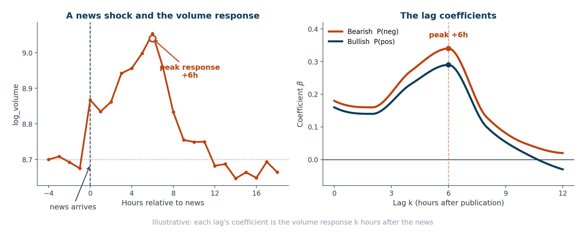
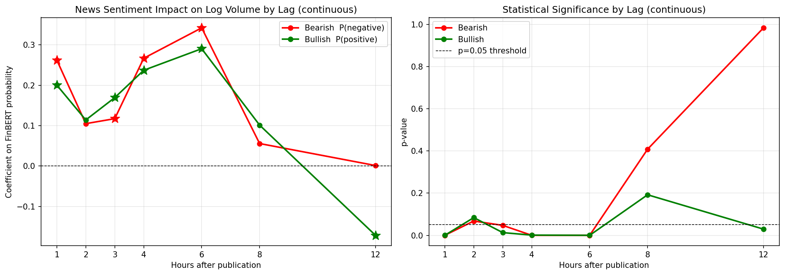
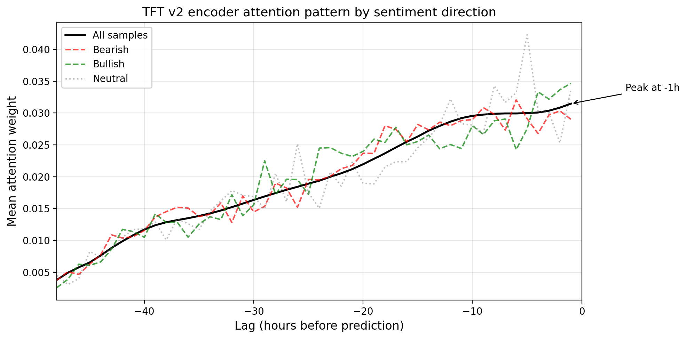

<!-- _class: lead -->
<!-- _paginate: false -->
<!-- _footer: '' -->

# News-Driven Liquidity Dynamics in WTI Crude Oil Futures: A Channel-Decomposition Approach

## A Channel-Decomposition Approach

<br>

**Enrique Favila**

Radboud University · Hammer Market Intelligence

<span class="small" style="color:#94a3b8">2026</span>

---

## Motivation

- **News moves markets.** Media sentiment forecasts trading _activity_, not only prices (Tetlock, 2007).
- But most empirical work operates at **daily** resolution, averaging away the intraday window where information actually propagates.
- **WTI crude oil** is an ideal setting: a rich, well-dated event structure (OPEC, geopolitics, the weekly EIA inventory cycle, macro) on top of a deeply liquid market.

<br>

> How does news propagate into WTI liquidity at **hourly** resolution? Can we somehow measure the impact? What hits harder the oil liquidity dynamics?

---

## Research questions

### RQ1 Lag structure

At what lag does news sentiment exert its strongest effect on WTI trading liquidity?

### RQ2 Directional asymmetry

Does the liquidity response differ between **bearish** and **bullish** news?

<br>

<span class="small">Liquidity is measured hourly: <strong>log trading volume</strong> (primary), the Amihud illiquidity ratio, and the Parkinson high-low range.</span>

---

## Data

| Source     | What                                | Scale                                               |
| ---------- | ----------------------------------- | --------------------------------------------------- |
| **Market** | WTI front-month hourly (+ DXY, VIX) | 11,232 hours · May 2024 – May 2026                  |
| **News**   | GDELT article corpus                | 76,345 raw → **22,795** unique (19,619 with bodies) |
| **Macro**  | EIA weekly crude inventories        | weekly release cycle                                |

<br>

A geopolitical **structural break** (Iran-Israel war onset, early 2026) splits the test window into a **pre-war** and a **war** regime, a natural generalization test.

---

## Liquidity: our ground truth

Every liquidity target is computed **deterministically** from the hourly WTI OHLCV bar (yfinance). These are objective measurements, not model outputs.

| Variable      | Formula                     | What it captures                               |
| ------------- | --------------------------- | ---------------------------------------------- |
| `log_volume`  | `ln(volume)`                | trading **activity** per hour (primary target) |
| `amihud`      | `abs(log_return) / volume`  | **price impact** per unit traded (Amihud 2002) |
| `price_range` | `ln(high) − ln(low)`        | intraday **volatility** (Parkinson range)      |
| `log_return`  | `ln(close_t / close_{t−1})` | hourly return (used to calculate `amihud`)     |

<span class="small">`log_volume`, `amihud`, and `price_range` are the three targets the TFT predicts jointly. `amihud` is undefined for zero-volume hours, which are dropped when it is the target.</span>

---

## General Methodology: a two-phase design

<div class="flow">
<div class="box">

### Phase 1: Baseline

Interpretable, classical

FinBERT 3-class sentiment
&nbsp;&nbsp;↓
Lag OLS regressions

<span class="small">Transparent assumptions</span>

</div>
<div class="arrow">→</div>
<div class="box">

### Phase 2: Extraction

Richer, more expressive

LLM structured extraction
(channels + entities)
&nbsp;&nbsp;↓
Temporal Fusion Transformer

<span class="small">Interpretable deep learning</span>

</div>
</div>

<br>

Neither phase is discarded: **Phase 2 corroborates what Phase 1 discovers through an independent method and enriches the analytical process.**

---

## Phase 1: Method

- **FinBERT** (domain-adapted transformer; Araci, 2019) scores each article: probabilities of _negative_, _neutral_, _positive_ tone.
- Articles aligned to the hourly market grid.
- **Lag OLS** at each horizon `k`:

$$\text{log\_volume}_{t+k} = \beta_0 + \beta_1\,P(\text{neg})_t + \beta_2\,P(\text{pos})_t + \varepsilon_t$$

- $\beta_1, \beta_2$: volume response to a maximally confident bearish or bullish article, relative to a neutral one. Corpus: 13,690 articles.

---

## Phase 1: Ordinary Least Squares (OLS)

<div class="cols">
<div class="col">

**What it is**

The classical linear regression: fit a linear relationship by minimizing squared error. Here, a **lag regression** of hourly `log_volume` on FinBERT sentiment probabilities, run separately at each horizon `k`.

- **Coefficients** with signs, magnitudes, and **p-values**.
- RQ1 reads off directly: the lag with the largest significant coefficient is the peak.
- RQ2 reads off directly: $\beta_{\text{bearish}}$ vs $\beta_{\text{bullish}}$.
- Effect sizes in plain units (a bearish article → **+41%** volume at +6h).

</div>
<div class="col">

**Why it was chosen for Phase 1**

- **Interpretability first:** the coefficients map one-to-one onto RQ1 (lag) and RQ2 (asymmetry), a clean and defensible first answer.
- **A credible baseline:** transparent, well-understood assumptions; a result that survives a simple model is unlikely to be an artifact.
- **Fits the type of signal:** most hours carry no news; a per-article cross-section handles this event-driven data cleanly.
- **Sets up Phase 2:** its deliberate simplicity (one sentiment axis, one lag at a time) exposes the limits the TFT then addresses.

</div>
</div>

---

## How the coefficients move

<div style="text-align: center;">



</div>

<span class="small">Illustrative dynamics with synthetic data. The real fitted coefficients follow in Phase 1 — Results.</span>

---

## Phase 1: Dataset

<div class="cols">
<div class="col">

| Stage                             |      Count |
| --------------------------------- | ---------: |
| Raw GDELT articles (8 queries)    |     51,948 |
| Unique (dedup + English)          |     16,326 |
| Substantive body (`body_valid=1`) |      7,756 |
| Title-only fallback               |      5,934 |
| **Modeling dataset**              | **13,690** |
| Aligned market hours              |     11,219 |

</div>
<div class="col">

**FinBERT sentiment** (13,690 articles)

- **44.9%** negative
- **30.4%** positive
- **24.7%** neutral

<span class="small">The bearish skew reflects a headline-tone tendency (see the headline-bias finding), not a population-level claim.</span>

<span class="small">**Coverage:** March 2024 – February 2026 (pre-war only).</span>

</div>
</div>

---

## Phase 1: Preliminar results

- **RQ1:** the effect peaks at **+6h** ($\beta_{\text{neg}}=0.342$, roughly **41% more volume** than a neutral hour), with a secondary trace at +12h. Not contemporaneous.
- **RQ2:** **bearish > bullish** at the dominant lags (about 18% larger at +6h).

<div style="text-align: center; margin-top: 14px;">



</div>

<span class="small">The **p-value** is the probability of seeing a coefficient this large if news truly had no effect on volume. A small value (below 0.05) means the result is unlikely to be a chance artifact, which is why it is the standard gauge of statistical significance. The +6h and +12h peaks clear that threshold; the near-zero lags do not.</span>

---

## Phase 1: Findings and limitations

<div class="cols">
<div class="col">

**Findings**

- **RQ1:** the news-liquidity response peaks at **+6h**, delayed rather than contemporaneous.
- **RQ2:** a robust **bearish > bullish** asymmetry at the dominant lags.
- **Headline bias:** title vs full-body sentiment disagree on **41.6%** of articles.
- An exploratory **VAR was abandoned**: the hourly news signal is too sparse for a joint time-series model.

</div>
<div class="col">

**Limitations that motivate Phase 2**

- FinBERT gives **one sentiment axis** (no magnitude, event type, entities), loses different dimensional information.
- The regex filter is **lexical, not semantic**, high rate of false negatives and positives.
- The signal is **sparse**: about half of hours carry no news.
- The corpus is **pre-war only** (ends Feb 2026).
- The OLS has **no macro controls**, in a complex liquidity dynamic matters

</div>
</div>

<span class="small">Each limitation maps to a specific Phase 2 change: LLM extraction, a semantic filter, a TFT built for sparse inputs, corpus extension through the war, and DXY/VIX covariates.</span>

---

## Phase 1: Headline bias: Titles vs full bodies

<div class="cols">
<div class="col">

- Same FinBERT model, two inputs: **title only** vs **title + body**.
- They disagree on **41.6%** of articles (p < 0.001).
- Systematic, not noise: titles lean **more bullish**; reading the body shifts sentiment bearish (mean signed shift **−0.09**; **57.6%** turn more bearish).
- **Implication:** a title-only pipeline silently inherits this bias, so Phase 2 extracts from **full bodies**.

</div>
<div class="col">

| Divergence (7,755 articles) |               Value |
| --------------------------- | ------------------: |
| Label agreement             |       4,527 (58.4%) |
| **Label flip**              |   **3,228 (41.6%)** |
| Flip rate: pos / neu / neg  | 40.8 / 69.5 / 21.8% |
| Mean magnitude: flip / same |         0.96 / 0.17 |
| Signed shift (title→body)   |           **−0.09** |
| More bearish after body     |               57.6% |

</div>
</div>

---

## Phase 2: The Temporal Fusion Transformer (TFT)

<div class="cols">
<div class="col">

**What it is**

An attention-based neural network for **multi-horizon** time-series forecasting (Lim et al., 2021), built to be accurate _and_ interpretable.

**How it works**

- Encodes a **48h** window of news + market features, then forecasts **1 / 3 / 6 / 12h** jointly.
- **Variable Selection Networks:** a learned weight per feature (_which_ inputs matter).
- **Interpretable attention:** a weight per past hour (_when_ the signal sits).
- Outputs **quantiles** (intervals), not just point estimates.

</div>
<div class="col">

**What we expect from it**

- A forecaster of hourly liquidity driven by the decomposed news features.
- Two diagnostics read directly off the model: **feature importance** and **temporal attention**.
- To **corroborate RQ1** (the +6h lag) and probe RQ2 through an independent method, triangulating Phase 1 rather than acting as a black box.

</div>
</div>

---

## Phase 2: Method

- Replace FinBERT with **LLM** structured extraction per article:
  - composite **sentiment** + three orthogonal channels: **supply - demand - risk** (mirroring Kilian's 2009 oil-shock decomposition)
  - magnitude, certainty, event type, and **71 entity flags**
- **Why channels?** A single composite sentiment score disagreed across model families (Haiku vs GPT) on the geopolitical events that move the market. The response: decompose it into three separable channels.
- Model: **Temporal Fusion Transformer** (Lim et al., 2021): 3 targets × 4 horizons, interpretable via variable selection and attention.

---

## From headline to features

One of FinBERT's limitation was that news had a lot of features that change how impactful news can be, and condensing that feature set into a single number lost key information.

<div class="flow" style="align-items: center;">
<div class="box">

<span class="small">GDELT article · thehindubusinessline.com · 2 Mar 2026</span>

**"Crude oil could top \$100 as Strait of Hormuz closure halts flows"**

<span class="small">"...Iran warned shipping away from the strait and insurers withdrew coverage, effectively halting tanker movements."</span>

</div>
<div class="arrow">→</div>
<div class="col">

<span class="small">**LLM** structured judgment</span>

```json
{
  "usable": true,
  "sentiment_score": 0.95,
  "supply_impact": -1.0,
  "demand_impact": 0.0,
  "risk_premium": 1.0,
  "magnitude": 1.0,
  "certainty": 0.9,
  "event_type": ["geopolitical", "supply"],
  "time_horizon": "immediate",
  "entities": ["United States", "Israel", "Iran", "Wood Mackenzie", "Strait of Hormuz"]
}
```

</div>
</div>

A supply threat reads as **bullish for price** (`sentiment_score +0.95`), while the channels record _why_: `supply_impact −1.0`, `risk_premium +1.0`. A single tone score could not separate these.

---

## Phase 2: Why the LLM filter beats regex

Both filters answer the same question for the same **19,619** articles: _does this carry substantive WTI content?_ They agree on **75.2%** (Cohen's κ = 0.47). The disagreement is where the LLM wins:

| Disagreement                   |     Count | What these are                                                    |
| ------------------------------ | --------: | ----------------------------------------------------------------- |
| Regex accepts, **LLM rejects** | **3,366** | long, keyword-matched, off-topic (palm oil, canola, equity wraps) |
| Regex rejects, **LLM accepts** | **1,491** | short but on-topic briefs (e.g. a 320-char OPEC+ note)            |

- Regex is **blind to topic**: it passes long articles that merely match a keyword (false positives).
- Its 400-character cutoff is **blunt**: it drops short but relevant briefs (false negatives).
- The LLM **reads the body**, so it is correct on both axes. A manual audit confirms its call in the large majority.

<span class="small">Not an oracle: a few residual LLM errors remain (e.g. an EV-tariff article marked usable). Still, it is more accurate than regex on both of the regex's failure modes, so the LLM `usable` flag becomes the canonical Phase 2 filter.</span>

---

## Inter-model calibration: why decompose

Same 30 stratified articles scored independently by two LLMs from different families (**Haiku** and a **GPT reference**). Cross-family disagreement flags genuine ambiguity.

<div class="cols">
<div class="col">

**The problem (composite only)**

A single sentiment number conflated _event valence_ with _price direction_, so the two models read **opposite signs** on the high-magnitude geopolitical events that move the market.

</div>
<div class="col">

| Metric                | Composite | + Channels |
| --------------------- | --------: | ---------: |
| Sentiment correlation |      0.39 |   **0.88** |
| Sign disagreement     |       31% |     **7%** |
| Supply channel        |       n/a |       0.94 |
| Demand channel        |       n/a |       0.96 |
| Risk channel          |       n/a |       0.82 |

</div>
</div>

Decomposing into supply / demand / risk **disciplined the composite** (0.39 → 0.88) and yielded channels two independent models agree on.

---

## Dataset: Phase 1 → Phase 2

|                  | Phase 1               | Phase 2                                      |
| ---------------- | --------------------- | -------------------------------------------- |
| GDELT queries    | 8                     | **13**                                       |
| Raw articles     | 51,948                | **76,345**                                   |
| Unique articles  | 16,326                | **22,795**                                   |
| Modeling corpus  | 13,690                | **10,514** (`usable_strict`)                 |
| Coverage         | to Feb 2026 (pre-war) | to **May 2026** (incl. war)                  |
| News features    | FinBERT 3-class       | **LLM** sentiment + 3 channels + 71 entities |
| Macro covariates | none                  | **DXY, VIX**                                 |

Phase 2 is **larger and temporally complete** (it now covers the war regime), yet its modeling corpus is _smaller_: a stricter LLM filter and no title-only fallback trade quantity for signal quality.

---

## How the reported model was chosen: the ablation

| Variant                     | Key change                                     | What it showed                                                        |
| --------------------------- | ---------------------------------------------- | --------------------------------------------------------------------- |
| **TFT v1**                  | 1 target, 1 horizon, ~12 features              | deep learning beats persistence (val_loss 0.204)                      |
| **v2.0**                    | Schema v2 channels, _int-encoded_ categoricals | channels present but **inert** (top feature: sentiment 0.274)         |
| **v2.1**                    | _proper_ categorical encoding                  | **unlocks the channels**: demand_impact → 0.485, MAE@1h 0.455 → 0.424 |
| **v2.2 exp2** _(canonical)_ | 3 targets × 4 horizons + 71 entity flags       | the reported model: VIX + supply/demand + entities lead               |

- The pivotal step is **v2.0 → v2.1**: fixing the categorical encoding is what makes the channels predictive, not adding data.
- **Val loss is not a race across rows**: v1 and v2.0/v2.1 are single-target, v2.2 is a `MultiLoss` over three targets. Selection is on design capability, not raw loss.

<span class="small">Full per-run record in Appendix C and `05_reports/v2_training_results.md`.</span>

---

## TFT v2: baseline vs the reported model

| Design axis  | v2.0 (baseline) | v2.2 exp2 (reported)                    |
| ------------ | --------------- | --------------------------------------- |
| Targets      | `log_volume`    | `log_volume` · `amihud` · `price_range` |
| Horizons     | 1h              | 1 / 3 / 6 / 12h                         |
| Categoricals | integer-encoded | proper embeddings                       |
| Entity flags | none            | **71**                                  |

<span class="small">Both train on the same Phase 2 corpus (`usable_strict`, 11,232-hour grid). All reported Phase 2 results use **v2.2 exp2**; v2.0 is the simplest ablation variant. The ablation showed that proper categorical encoding is what unlocks the channels' predictive role.</span>

---

## Phase 2: Results

After a series of experiments varying between dataset features and tuning model params, the **TFT version 2.2 - experiment 2** extends:

- It beats a persistence baseline substantially: **log_volume 46–71%** MAE reduction, amihud 43–45%.
- **Attention:** bearish-sentiment attention peaks at **−6h**, independently corroborating the Phase 1 +6h lag.

<div style="text-align: center; margin-top: 14px;">



</div>

---

## Phase 2: Top features (Variable Selection Network)

<div class="cols">
<div class="col">

|   # | Feature       | Weight | Type     |
| --: | ------------- | -----: | -------- |
|   1 | VIX           |  0.188 | macro    |
|   2 | supply_impact |  0.121 | channel  |
|   3 | ent_oman      |  0.113 | entity   |
|   4 | demand_impact |  0.055 | channel  |
|   5 | is_wednesday  |  0.022 | calendar |
|   6 | ent_japan     |  0.017 | entity   |
|   7 | ent_eu        |  0.016 | entity   |
|   8 | ent_iran      |  0.015 | entity   |
|   9 | ent_china     |  0.014 | entity   |
|  10 | ent_algeria   |  0.014 | entity   |

</div>
<div class="col">

**The reading**

- **VIX** (market-wide volatility) leads.
- Both news **channels** land in the top four (supply, demand).
- **6 of the top 10 are entity flags**, geopolitical actors around the Strait of Hormuz.
- The composite `sentiment_score` does **not** make the top 10.

<br>

> **Risk and salience**, not price direction, drive the model.

<span class="small">Feature-_type_ dominance is robust; exact per-feature order shifts across retrains.</span>

</div>
</div>

---

## RQ2, more precisely

- The TFT shows **no** bearish-vs-bullish gap in predicted volume (**0 of 16** tests significant).
- Not a failed replication: the two phases estimate **different quantities**.
  - OLS: a _marginal coefficient_ (sensitivity, holding other terms fixed).
  - TFT: a _group-mean_ difference (unconditional).
- **Tone vs price:** FinBERT (tone) and Haiku (price) flip sign on geopolitical news. A supply threat is bearish in _tone_ but bullish for _price_.

> For the TFT it is not a matter of negative versus positive news, but of the **risk premium** the news implies.

---

## Key findings

- **RQ1:** news propagates into WTI liquidity over a **+6 to +12 hour** window, recovered independently by a linear baseline and a deep-learning forecaster.
- **RQ2:** a robust **bearish > bullish** asymmetry in _marginal sensitivity_ (Phase 1); at the level of predicted volume the model organizes around **risk and salience over direction** (Phase 2).
- Supporting findings: the **channel decomposition**, the **LLM-as-filter**, and the **41.6% headline bias**.

---

## Limitations

- **Regime extrapolation:** `price_range` fails on the unseen war regime (trained pre-war only). A clean illustration of a model bound by its training window.
- **Single commodity:** confined to WTI; the risk-and-salience reading may be specific to its geopolitical supply structure.
- **Corpus composition:** GDELT skews to retail-facing web and print, not institutional feeds.
- **Validation:** LLM features are checked by cross-model agreement, not human ground truth.

---

## Conclusion

Three contributions:

- **(a)** An empirical lag-and-asymmetry characterization for WTI at **hourly** resolution.
- **(b)** A **channel decomposition** of LLM-extracted news features, validated by cross-model agreement.
- **(c)** A quantified **title-vs-body headline bias** (41.6%).

Underlying all three: a reusable **two-phase template**, an interpretable baseline plus an expressive model, with neither discarded.

---

<!-- _class: lead -->
<!-- _paginate: false -->
<!-- _footer: '' -->

# Thank you

## Questions?

<br>

<span class="small" style="color:#cbd5e1">Enrique Favila · News-Driven Liquidity in WTI Crude Oil Futures</span>
