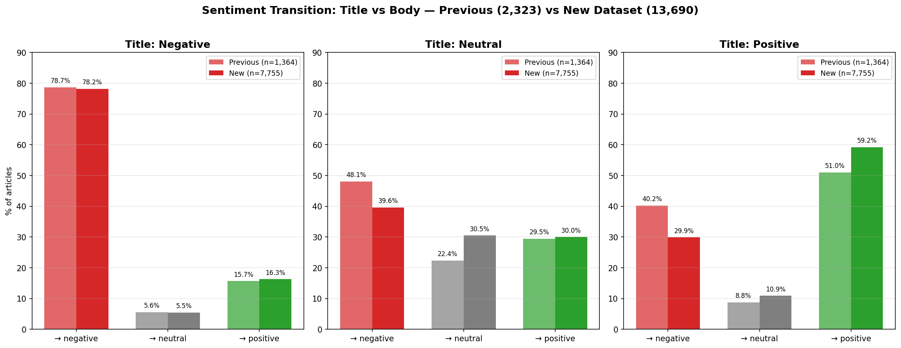
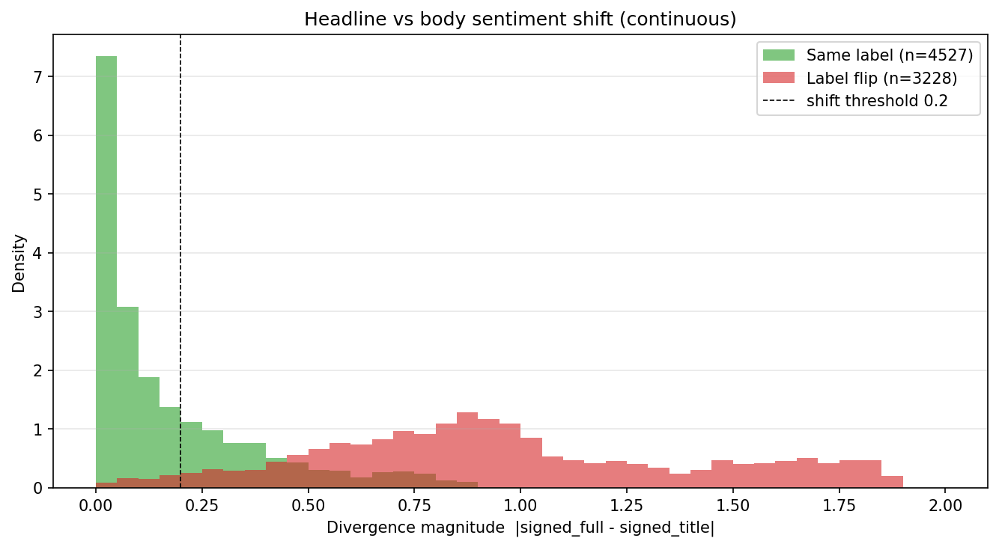

# Chapter 4 - Experiments

## 4.1 Overview

This chapter reports the empirical results of both methodological phases of the thesis. Phase 1 (§4.2) presents the regression-based analysis of the pre-war corpus, including the headline bias experiment, the contemporaneous and lag OLS regressions that establish the initial evidence for RQ1 and RQ2, and the VAR model. Phase 2 (§4.3) presents the deep-learning analysis of the expanded corpus, including the LLM feature extraction pipeline, the Temporal Fusion Transformer models (v1 and v2), and the ablation study that guided the v2 design. The chapter closes with a methodological comparison of the two phases (§4.3.8), articulating what Phase 2 changed and why direct numerical comparison between the two phases is not appropriate.

## 4.2 Phase 1 - Initial pipeline and baseline modeling

Phase 1 establishes the empirical baseline for the research questions of this thesis. It uses the FinBERT-extracted news sentiment described in Section 3.3.1 together with the regex-based body validity filter of Section 3.4.1, applied to a corpus of WTI-relevant news articles published between March 2024 and February 2026. Three modeling techniques are applied in turn: linear regression (contemporaneous and lagged), vector autoregression, and a headline-bias comparative experiment that motivates the broader use of full article bodies in downstream feature extraction. By the end of Phase 1, the canonical statistical evidence for RQ1 (lag structure) and RQ2 (bearish-versus-bullish asymmetry) is in hand, and the limitations of the FinBERT-plus-classical-models pipeline are visible enough to motivate the methodological refinements that follow in Phase 2.

### 4.2.1 Phase 1 data and feature setup

The Phase 1 analyses operated on a combined dataset of 13,690 articles: 7,756 with valid bodies feeding title-plus-body sentiment extraction, and 5,934 articles where body retrieval failed but the title alone was retained as a fallback input.

**Market data.** Hourly OHLCV data for the WTI front-month futures contract (`CL=F`) was downloaded via `yfinance` for the full Phase 1 window, yielding 11,219 hourly price records over the period from 11 March 2024 to 11 March 2026. From these we derive `log_volume` as the primary liquidity measure, `price_range` as a Parkinson volatility proxy, `log_return` for the hourly return series, and `amihud` as an illiquidity measure. Phase 1 does not use the DXY or VIX series as covariates in any of the classical statistical models; these enter only in Phase 2 with the TFT modeling.

**EIA inventory data.** The weekly U.S. crude oil inventory series (WCRSTUS1) over the Phase 1 window contains 104 reported releases. After temporal alignment, each release contributes a binary `is_eia_release` flag at the trading hour containing or immediately following the official 10:30 a.m. ET release time, plus a continuous `eia_surprise` value measuring the inventory change relative to a rolling four-week baseline.

**News data.** The Phase 1 GDELT scrape across eight oil-market-focused queries produced 51,948 raw article records. After deduplication and English-language filtering, 16,326 unique articles remained. Body content was retrieved by HTTP-fetching each URL and parsing the page, yielding a body retrieval success rate of approximately 80%. The regex/keyword allow-list filter (`body_valid`) classified 7,756 articles as having substantive bodies suitable for title-plus-body sentiment extraction. The remaining articles either failed body retrieval or were rejected by the filter; 5,934 of these retained a usable title and were carried forward with title-only sentiment as a fallback. The combined Phase 1 modeling dataset thus contains **13,690 articles**: 7,756 with valid bodies and 5,934 with title-only fallback.

**FinBERT sentiment extraction.** Each article was scored twice by FinBERT: once on the title alone, once on the title concatenated with the body. For each input FinBERT returns softmax probabilities over the three classes (positive, neutral, negative) and an argmax label. The Phase 1 statistical analyses use the title-plus-body class probabilities directly as the continuous sentiment feature (Section 3.3.1), with the discrete label mapped to `{+1, 0, -1}` retained as a baseline; the title-only output (`title_sentiment`) is reserved for the comparative headline bias experiment of Section 4.2.2. Across the 13,690 articles, the sentiment distribution is **44.9% bearish, 30.4% bullish, and 24.7% neutral**. The bearish skew reflects the documented tendency of financial news headlines to overrepresent negative tone (Section 4.2.2), and is not interpreted as a population-level claim about the news cycle.

**Temporal alignment.** Each article was assigned to the next trading hour via the ceiling rule described in Section 3.2.1. The assignment gap is below two hours for 11,316 articles (82.7%) and at least two hours for 2,374 articles (17.3%). Articles with larger gaps are predominantly published during overnight, weekend, or holiday windows and are forward-assigned to the next available trading hour. The VAR analysis (Section 4.2.5) aggregates contemporaneous articles to hourly resolution before estimation; the OLS regressions (Sections 4.2.3 and 4.2.4) use the full Phase 1 corpus regardless of gap.

**Table 4.1** summarises the Phase 1 dataset construction.

| Stage                                                | Count                               |
| ---------------------------------------------------- | ----------------------------------- |
| Raw GDELT articles                                   | 51,948                              |
| After deduplication + English filter                 | 16,326                              |
| With successful body retrieval                       | ~13,000 (80% of 16,326)             |
| With `body_valid=1` (regex-passed body)              | 7,756                               |
| Title-only fallback (body failed but title retained) | 5,934                               |
| **Phase 1 modeling dataset**                         | **13,690**                          |
| Aligned market hours (raw, before VAR cleaning)      | 11,219                              |
| Articles aligned within 2h gap (contemporaneous)     | 11,316                              |
| Articles aligned with gap ≥ 2h (forward-assigned)    | 2,374                               |
| Article date range                                   | 2024-03-11 10:30 → 2026-03-01 00:30 |

This dataset is the substrate for the three Phase 1 experiments that follow.

### 4.2.2 Headline bias experiment

**Motivation.** The Phase 1 NLP pipeline distinguishes two input regimes for FinBERT: title-only, used when body retrieval has failed, and title-plus-body, used when a substantive body is available. The two regimes coexist in the 13,690-article modeling dataset described in Section 4.2.1. Before treating the resulting `full_sentiment` series as a unified signal, we need to know whether the title-only regime produces sentiment scores systematically different from the title-plus-body regime. If the two regimes disagree at a meaningful rate, downstream models that mix them are silently combining two different measurements.

The question is also of independent interest. Financial news headlines are widely understood to attract attention through emotionally loaded language, and the body of an article can substantially qualify or even reverse the implication a reader draws from the headline alone. Whether this qualitative observation translates into a measurable, quantifiable sentiment disagreement when both are processed by the same model is an empirical question that the Phase 1 corpus is well-positioned to answer.

**Method.** For each of the 7,755 articles with both a title and a substantive body (the `body_valid=1` subset), FinBERT was applied twice: once on the title alone, producing `title_sentiment`, and once on the concatenated title-plus-body, producing `full_sentiment`. Both outputs use the same FinBERT model checkpoint and the same softmax decoding, as described in Section 3.3.1. Every articulated source of variation between the two scores is therefore attributable to the input content, not to the model or its post-processing. We measure divergence in two complementary ways: a categorical measure on the argmax labels, and a continuous measure on the underlying probability distribution.

We compare the two score series at the article level. Three measures are reported:

- **Agreement rate**: the fraction of articles for which `title_sentiment` equals `full_sentiment` exactly (same category)
- **Disagreement distribution**: a 3×3 contingency table showing how title-derived categories map to body-derived categories, broken down by direction of transition
- **Chi-squared test of independence**: testing the null hypothesis that the title and body sentiment classifications are statistically independent

**Result (categorical).** The two sentiment series agree on `58.4%` of articles and disagree on the remaining `41.6%`. The chi-squared test rejects independence at very high confidence (χ² = 2050, p < 0.001). The disagreement is structurally asymmetric: when the title is classified as positive, the body classification is also positive in only `59.2%` of cases, with the remaining `40.8%` shifting toward neutral (`10.9%`) or negative (`29.9%`). When the title is classified as negative, the body classification remains negative in `78.2%` of cases, with much smaller shifts toward neutral or positive. Titles classified as neutral show the strongest realignment after body content is included: `39.6%` shift to negative, `30.0%` shift to positive, with `30.5%` remaining neutral.

**Result (continuous).** The categorical measure registers a divergence only when the title and body fall in different classes, which ignores how far the sentiment moved and misses shifts inside articles that keep the same label. To capture both, we define a signed sentiment on `[-1, +1]` for each input as `P(positive) − P(negative)` and take the divergence magnitude as `|signed_full − signed_title|`. Articles whose categorical label flips carry a mean magnitude of `0.96`, close to a full sentiment reversal. Articles whose label does not flip still carry a mean magnitude of `0.17`, and `31.6%` of them move by more than `0.20`, so the `41.6%` categorical disagreement rate understates how much the body revises the headline. The signed direction is informative: the mean shift from title to body is `−0.09` (mean signed title `−0.08`, mean signed full `−0.17`), and `57.6%` of articles become more bearish once the body is read.



**Figure 4.1: Headline bias comparison across the Phase 1 corpus.** Title vs body sentiment transitions broken out by title classification (negative, neutral, positive). Each panel shows the body-sentiment distribution conditional on the title sentiment. The asymmetric shift toward negative interpretation when the title is positive, and the relative stability of negative titles, is the headline bias finding.



**Figure 4.2: Continuous headline-bias divergence magnitude.** Distribution of the per-article divergence magnitude `|signed_full − signed_title|`, split by whether the argmax label flips. Label flips (red) cluster near a full sentiment reversal (mean 0.96), while same-label articles (green) still carry a non-trivial shift (mean 0.17, with 31.6% exceeding 0.20). The continuous measure captures sentiment movement that the categorical flip rate misses.

The result has two implications for the rest of the thesis. First, **the choice of input regime matters substantially**: a sentiment pipeline that treats title-only and title-plus-body interchangeably is averaging over a 41.6% categorical disagreement rate (and, on the continuous measure, a mean movement of `0.50` in signed sentiment), and any conclusion drawn from such a pipeline must acknowledge that the underlying signal is heterogeneous. Second, **titles lean more bullish than the articles they head**: reading the body moves FinBERT's sentiment more negative on average (mean signed shift `−0.09`), positive titles frequently sit atop bodies the model reads as neutral or negative, and neutral titles resolve toward negative more often than toward positive, while negative titles are largely faithful. Headlines therefore understate the downside that the body elaborates. This is the opposite of the common intuition that attention-grabbing headlines overstate negativity, and it is a direction that the categorical labels alone could not establish; only the signed continuous score fixes the sign of the bias.

**Interpretation in the Phase 1 modeling context.** The 5,934 title-only fallback articles in the Phase 1 modeling dataset are, by construction, a non-representative subsample of the news corpus: they are precisely the articles for which body retrieval failed, often due to paywalls or aggressive anti-scraping measures on the original source. These articles enter the Phase 1 OLS and VAR analyses with a sentiment score that, per the finding above, would have shifted in roughly 40% of cases if a body had been available. The lag OLS results in Section 4.2.4 should be read with this measurement-bias awareness in mind, although the structured pattern across lags is robust to it: the systematic shift documented here affects all lags in the same direction, attenuating any true effect rather than spuriously creating one.

**Methodological role.** This experiment becomes a recurring reference point in the thesis. It is the first concrete demonstration that the choice of news representation matters for downstream sentiment-based analysis. It also motivates the Phase 2 decision to extract richer features directly from article bodies via the LLM extraction pipeline of Section 3.3.2: if the body content can shift sentiment classification by 40% relative to the title alone, the body is also where the richer dimensions of news interpretation such as supply implications, demand implications, geopolitical risk, event magnitude, named actors must be drawn from. Phase 2's structured LLM extraction is the methodological response to the finding documented here.

### 4.2.3 Contemporaneous OLS

**Motivation.** The first statistical test asks the simplest possible question: at the moment a news article is published, is hourly trading volume measurably different from a baseline? Under the ceiling alignment rule (Section 3.2.1), each article is assigned to the trading hour immediately following its publication, so the contemporaneous regression measures the relationship between an article published in a given hour and the trading volume of the next one-hour window. For news to act detectably within that window would require the market to incorporate the new information within minutes of publication, a strong requirement on the speed of information propagation.

**Method.** The contemporaneous specification, in its primary continuous form, is

```
log_volume_t = β_0 + β_1 · P(negative)_t + β_2 · P(positive)_t + ε_t
```

where `P(negative)_t` and `P(positive)_t` are the title-plus-body FinBERT class probabilities for the article published at hour `t`, with the neutral probability as the omitted reference (Section 3.5.1). The regression is estimated on the 13,690-article Phase 1 modeling dataset, with each article contributing one observation. The dependent variable is the `log_volume` value at the article's assigned trading hour. The coefficients `β_1` and `β_2` measure the average difference in `log_volume` for a maximally confident bearish or bullish article, respectively, relative to a neutral one. The discrete-dummy specification (bearish and bullish indicators from the argmax label) is retained as a baseline for comparison.

**Result.** In the continuous specification, both coefficients are statistically significant: `β_P(neg) = 0.186` (p < 0.001) and `β_P(pos) = 0.166` (p < 0.001), with R² = `0.0015` and a significant F-statistic (p = 2.8e-05). The discrete baseline gives `β_bearish = 0.133` (p < 0.001) and `β_bullish = 0.103` (p = 0.004) with R² = `0.0012`. Moving from hard labels to probabilities raises both coefficients and their significance and lifts the R², because the continuous encoding weights each article by FinBERT's confidence instead of counting a hedged classification the same as a decisive one.

**Interpretation.** Two features of this result are worth emphasising. First, the effect is small but real: a maximally confident bearish article (`P(negative) = 1`) is associated with a `log_volume` value approximately 20% higher (`exp(0.186) − 1 ≈ 20.4%`) than a neutral article in the same trading hour, and a maximally confident bullish article approximately 18% higher; typical articles, whose probabilities fall short of one, imply proportionally smaller differences. Second, the asymmetry observed in the lag analyses of Section 4.2.4 is already present in the contemporaneous regression: the bearish coefficient (0.186) exceeds the bullish coefficient (0.166). This contemporaneous asymmetry foreshadows the more pronounced asymmetry that the lag analysis will detect at horizons of one hour and beyond.

The small R² is methodologically not extraordinarily meaningful. Hourly trading volume in WTI is driven by many factors beyond news, and FinBERT sentiment is a coarse three-class signal even when its probabilities are used in full. The substantive finding is that this signal carries detectable information about contemporaneous volume, with a directional structure consistent with the lag findings that follow. The lag analysis of Section 4.2.4 extends the question: if sentiment is detectable at the moment of publication, how does the effect evolve over the hours that follow, and where is its peak?

### 4.2.4 Lag OLS - RQ1 and RQ2

The lag OLS regressions are the canonical Phase 1 evidence for RQ1 (lag structure of news impact on liquidity) and RQ2 (bearish-versus-bullish asymmetry). They constitute the most important empirical finding of Phase 1 and the result that subsequent methodological choices, including the channel decomposition of Phase 2, ultimately aim to corroborate and extend.

**Method.** The lag specification at horizon `k` is

```
log_volume_{t+k} = β_0 + β_1 · P(negative)_t + β_2 · P(positive)_t + ε_t
```

with the same continuous encoding as the contemporaneous specification of Section 4.2.3 (`β_1` and `β_2` on the FinBERT class probabilities, neutral as reference). A separate regression is estimated at each value of `k ∈ {1, 2, 3, 4, 6, 8, 12}`, producing seven independent regressions. The lag set is denser at short horizons, where information propagation is expected to be detectable, and sparser at longer horizons, where the effect is expected to attenuate. At each lag, the regression sample is the subset of the 13,690-article Phase 1 dataset for which the target hour `t + k` falls within the coverage window, yielding between roughly 9,900 and 11,600 rows per regression after boundary trimming (coverage falls as the lag lengthens).

For each lag, we report the coefficient estimates `β_1` and `β_2`, their p-values, and the regression R². The R² is expected to be small in absolute terms throughout, as sentiment is one input among many that influence hourly volume; the modelling goal is to detect a structured pattern of coefficients and significance across lags, not to maximise explanatory power.

**Result.** Table 4.2 reports the regression output across all seven lags.

| Lag `k` (hours) | β_P(neg) | p_P(neg) | β_P(pos) | p_P(pos) |     R² |      n |
| --------------: | -------: | -------: | -------: | -------: | -----: | -----: |
|               1 |    0.262 |    0.000 |    0.200 |    0.000 | 0.0028 | 11,598 |
|               2 |    0.105 |    0.068 |    0.114 |    0.084 | 0.0003 | 11,512 |
|               3 |    0.117 |    0.047 |    0.170 |    0.013 | 0.0006 | 11,360 |
|               4 |    0.267 |    0.000 |    0.237 |    0.001 | 0.0017 | 11,065 |
|               6 |    0.342 |    0.000 |    0.291 |    0.000 | 0.0027 | 10,679 |
|               8 |    0.056 |    0.409 |    0.101 |    0.192 | 0.0002 | 10,440 |
|              12 |    0.001 |    0.984 |   -0.171 |    0.029 | 0.0008 |  9,917 |

Three patterns are immediately visible:

1. **A clear peak at lag +6 hours.** Both the bearish probability coefficient (β = 0.342, p < 0.001) and the bullish one (β = 0.291, p < 0.001) reach their maximum magnitude at this horizon, both at very high statistical significance. The +6h coefficient implies that a maximally confident bearish article (`P(negative) = 1`) is associated with a `log_volume` value approximately 41% higher (`exp(0.342) − 1 ≈ 40.7%`) than a neutral article when measured six hours later, holding nothing else equal; a typical bearish article, with `P(negative)` well below one, implies a proportionally smaller effect.

2. **A bearish-greater-than-bullish ordering at the dominant lags.** At the three strongest horizons the bearish coefficient exceeds the bullish one: lag 1 (0.262 vs 0.200), lag 4 (0.267 vs 0.237), and the +6h peak (0.342 vs 0.291). The single exception is the much weaker lag 3, where both coefficients are small and the bullish coefficient is marginally higher (0.170 vs 0.117). At the peak, bearish exceeds bullish by approximately 18% (`(0.342 − 0.291) / 0.291 ≈ 17.5%`).
3. **A clean decay after lag 6.** Lags 8 and beyond show coefficients that are either statistically insignificant (lag 8) or that flip sign for the bullish series (lag 12, β = −0.171, p = 0.029). The peak effect is bounded above by approximately six hours from publication, with little durable signal beyond.


**Figure 4.3: Lag OLS coefficients and p-values across horizons.** Left panel: the bearish `P(negative)` and bullish `P(positive)` coefficients at lags 1, 2, 3, 4, 6, 8, and 12 hours. Stars mark lags where the coefficient is statistically significant at the conventional `p < 0.05` threshold. Right panel: the p-values for the same coefficients, with the `p = 0.05` reference line. The peak at lag +6h is the canonical finding for RQ1; the ordering of bearish above bullish at the dominant lags is the canonical finding for RQ2.

**Findings for RQ1.** The lag structure of news impact on hourly WTI liquidity is unambiguous: the impact is existent at the moment of publication, grows over the first few hours, peaks at six hours post-publication, and decays to insignificance by eight hours. The peak coefficient is significant at p < 0.001 for both bearish and bullish articles. The pattern is structured rather than monotonic, showing there is a secondary local maximum at lag 1 and a local minimum at lag 2 which suggests that the propagation process is not a simple exponential decay but instead reflects discrete information-incorporation events occurring at characteristic horizons.

**Findings for RQ2.** Bearish articles produce a stronger volume response than bullish articles at the dominant lags (1, 4, and the +6h peak), where the effect is both largest and most significant. At the peak lag of +6h, β_P(neg) exceeds β_P(pos) by approximately 18% (0.342 vs 0.291). The single exception is the weak lag 3, where both coefficients are small and the bullish coefficient is marginally higher; this does not overturn the pattern at the horizons that carry the effect. The asymmetry is methodologically robust to the two-probability specification used (Section 3.5.1): the two coefficients are estimated independently, so the observation that β_P(neg) > β_P(pos) at the strongest lags is not an artifact of an imposed model symmetry.

**Magnitude of effect.** While the R² values are small in absolute terms (peaking at 0.0028 at lag 1, with 0.0027 at the +6h coefficient peak) this is the expected magnitude for a two-feature regression on hourly trading volume. Volume at any hour is driven by macroeconomic news, scheduled releases, market-maker activity, options expirations, seasonal trading patterns, and time-of-day effects; news sentiment is one signal among many. The R² values measure how much of total volume variance sentiment alone captures, not how much of news-driven volume sentiment captures. The continuous encoding raises the R² over the discrete baseline at every lag, but only modestly, so the substantive finding remains the structured pattern of coefficients across lags rather than the absolute explained variance.

**Robustness considerations.** Three concerns about the lag OLS specification deserve discussion. First, the regression treats each article as an independent observation rather than as a sequential time series. This cross-sectional framing is appropriate because each row reflects a different article with its own bearish/bullish/neutral classification, and articles are not strongly serially correlated within the regression sample (no two articles share the same publication hour in a way that would create dependence across rows). Heteroskedasticity- and autocorrelation-consistent (HAC) standard error corrections are therefore not applied, as discussed in Section 3.5.1. Second, the 5,934 title-only-fallback articles in the Phase 1 dataset carry a sentiment classification subject to the headline bias documented in Section 4.2.2. As argued there, this bias attenuates rather than spuriously creates the lag pattern, since the headline bias acts in the same direction across all lags. Third, the alignment rule (Section 3.2.1) uses ceiling assignment, which guarantees that articles strictly precede the trading hour they are matched to; this rules out a reverse-causal interpretation but may underestimate the immediate (intra-hour) reaction, which is a conservative bias for the peak-lag finding rather than an inflationary one.

**Synthesis.** The lag OLS regressions deliver clean evidence for both research questions. RQ1's lag-structure question is answered with a structured pattern of coefficients peaking at +6h. RQ2's asymmetry question is answered with the consistent ordering of bearish-larger-than-bullish coefficients at every significant lag. Both findings will be revisited in Phase 2: the TFT v2 attention patterns (Section 4.3.7) provide an independent test of the lag-structure finding from a deep-learning angle, and the channel-decomposed features of Section 3.3.4 provide a richer substrate for understanding what makes the bearish response stronger than the bullish one.

### 4.2.5 Phase 1 summary

Phase 1 establishes the empirical core of the thesis and exposes the methodological limitations that the Phase 2 work will address. The findings, organised by research question, are as follows.

**RQ1 (lag structure).** The lag OLS regressions (Section 4.2.4) identify a structured pattern of news impact on hourly WTI trading volume. The effect is small at the moment of publication, grows over the first few hours, peaks at six hours post-publication with both class-probability coefficients reaching their maximum magnitudes (β_P(neg) = 0.342, β_P(pos) = 0.291, both p < 0.001), and decays to statistical insignificance by lag +8h. The pattern is not a simple exponential decay; the presence of secondary local maxima at lag +1h and lag +4h suggests that information propagation involves discrete incorporation events at characteristic horizons rather than a smooth diffusion process.

> This is the canonical Phase 1 evidence for RQ1.

**RQ2 (asymmetry).** Bearish articles produce a stronger volume response than bullish articles at the dominant horizons, where the effect is largest and most significant. The asymmetry is present from the contemporaneous regression onward: at lag k=0, β_P(neg) = 0.186 exceeds β_P(pos) = 0.166 (Section 4.2.3); at the peak lag of +6h, β_P(neg) = 0.342 exceeds β_P(pos) = 0.291 by approximately 18% (Section 4.2.4). The ordering holds at the contemporaneous regression and lags 1, 4, and 6; the only exception is the weak lag 3, where both coefficients are small and bullish is marginally higher, which does not overturn the pattern at the horizons that carry the effect. The asymmetry is methodologically robust to the two-probability specification used: the two coefficients are estimated independently, so the observation is not an artifact of an imposed symmetry. The coherence of the bearish > bullish ordering across the strongest lags is the canonical Phase 1 evidence for RQ2.

> This is the canonical Phase 1 evidence for RQ2.

**Headline bias as a comparative finding.** The 41.6% categorical sentiment disagreement between FinBERT applied to article titles only and the same model applied to titles concatenated with bodies (Section 4.2.2) is the first concrete demonstration that the choice of news representation matters substantially for downstream sentiment-based analysis. The continuous divergence measure sharpens it: label flips correspond to near-full sentiment reversals (mean magnitude 0.96), yet a third of same-label articles also shift non-trivially, so the categorical rate understates the effect. The direction is now unambiguous: reading the body moves sentiment more bearish on average (mean signed shift −0.09), so titles lean more bullish than the articles they head. This finding is independent of the RQ1 and RQ2 results but informs the design of Phase 2, where the structured LLM extraction operates on full article bodies wherever available.

**VAR exploration (abandoned).** An exploratory VAR was also fitted during Phase 1 to model the joint sentiment-volume dynamics. Because more than half of the hourly observations carry no contemporaneous news, the sentiment series is dominated by zeros; the impulse responses were not statistically significant, and the approach was abandoned in favour of a model class designed for sparse, event-driven inputs. This outcome is itself informative: it diagnoses the data as event-driven rather than regularly observed, which is the property the Temporal Fusion Transformer (Section 4.3) is chosen to respect.

**Phase 1 limitations driving Phase 2.** Five limitations of the Phase 1 pipeline motivate the methodological changes of Phase 2:

1. **FinBERT representation is coarse.** Even when its full class probabilities are used (as in the continuous OLS above), FinBERT reduces each article to a single sentiment axis. It still cannot represent dimensions that are naturally distinct: articles vary in magnitude (a minor inventory report vs. a major geopolitical escalation), in event type (supply, demand, geopolitical, macro), in certainty (analyst forecast vs. confirmed fact), and in time horizon (immediate vs. structural). Using the probabilities rather than the argmax label recovers confidence but none of these other dimensions, which is what motivates the richer Phase 2 schema.
2. **The regex `body_valid` filter has documented false positives and false negatives.** Articles passing the filter sometimes contain substantive boilerplate; articles failing the filter sometimes contain legitimate analyst commentary. The filter is fast and reproducible but not semantically discriminative.
3. **The sentiment signal is sparse.** With approximately 50% of hours containing no contemporaneous news, models that require regular joint observation of all variables like the VAR, cannot identify the dynamics they are designed to capture.
4. **The Phase 1 coverage window is restricted to the pre-war period.** The dataset ends in February 2026, missing the substantial repricing and elevated news intensity of the post-war months. A richer view of the news-liquidity relationship requires extending the corpus.
5. **The Phase 1 statistical models lack macro covariates.** Hourly volume in WTI is driven by many factors beyond news; the U.S. Dollar Index (DXY) and the CBOE Volatility Index (VIX) are obvious candidates for controlling broader macro-financial dynamics, and neither enters the Phase 1 OLS specifications.

Each of these limitations is addressed in Phase 2: the FinBERT representation is replaced by structured LLM extraction (Sections 3.3.2 and 4.3.2); the regex filter is replaced by the LLM-judged `usable` flag (Sections 3.4.2 and 4.3.3); the deep-learning Temporal Fusion Transformer handles the sparse event-driven signal directly (Sections 3.6 and 4.3.5); the corpus is extended through May 2026 (Section 4.3.1); and DXY and VIX enter the TFT feature set as exogenous controls (Sections 3.1 and 4.3.5).

Phase 2 begins with the FinBERT-to-LLM migration applied to the Phase 1 corpus, producing the feature set that supports the first TFT training. The subsequent inter-model calibration finding (Section 4.3.4) reveals a weakness in the composite sentiment score that motivates a further schema refinement (the channel decomposition of Section 3.3.4), and a corpus expansion (Section 4.3.1) extends the dataset before the final TFT v2 training (Section 4.3.7). This progression is intentional: each step responds to a concrete limitation exposed by the previous step, and each step is documented so that the methodological choices are traceable rather than asserted.

## 4.3 Phase 2: Refined pipeline and deep-learning modeling

Phase 2 responds to the limitations of Phase 1 documented in Section 4.2.6 with a coordinated set of methodological changes. The FinBERT three-class sentiment is replaced by structured LLM extraction, yielding a richer feature schema. DXY and VIX enter the modeling pipeline as macro covariates. The regex `body_valid` filter is replaced by an LLM-judged `usable` flag. A Temporal Fusion Transformer is introduced as the primary deep-learning model. The Phase 2 dataset is then expanded with additional GDELT queries to cover the post-war period through May 2026.

The phase unfolds as a sequence of interdependent steps rather than a single redesign. The used LLM schema (Schema v1) is first deployed to support the initial TFT training (TFT v1). Inter-model calibration on this schema reveals a weakness in the composite sentiment score that motivates a schema revision (Schema v2) introducing three orthogonal economic channel scores and the `usable` flag. The full LLM extraction then runs on the expanded corpus with this revised schema, supporting the final TFT v2 training. This subsection structure follows that chronology: the data setup is described first (§4.3.1), then the LLM extraction (§4.3.2), then the filter migration (§4.3.3), the first calibration result (§4.3.4), TFT v1 (§4.3.5), the schema response (§4.3.6), the full batch and TFT v2 (§4.3.7), and a Phase 1 vs Phase 2 comparison (§4.3.8).

### 4.3.1 Phase 2 data and feature setup

The Phase 2 dataset extends the Phase 1 corpus in two directions. First, the GDELT scrape was extended through May 2026 to incorporate news from the post-war period that the Phase 1 window had missed. Second, the query set was expanded with five new queries targeting geopolitical and demand-side themes that became prominent during the war period. The full Phase 2 query set is reproduced in Section 3.1.

After scraping with the expanded query set across the full coverage window, the total corpus contains **22,795 article records** spanning January 2024 to May 2026. Across this corpus, 20,046 articles produced a non-null body response; of these, 427 are recognised scraping errors (body fields prefixed with `ERROR`), leaving **19,619 articles with substantive body content** for downstream LLM extraction. The remaining 2,749 articles produced a null body response (paywall, fetch failure, JavaScript-rendered content).

> 19,619 articles ready for LLM feature extraction.

**Macro covariates added.** Hourly OHLCV data for two additional series, the U.S. Dollar Index (`DX-Y.NYB`) and the CBOE Volatility Index (`^VIX`), were retrieved via `yfinance` for the full Phase 2 coverage window. Both series enter the TFT modeling pipeline as exogenous controls under the framing of Section 3.6.2. The rationale for adding macro covariates was empirical: the Phase 1 OLS analyses (Section 4.2.4) detected a statistically significant news effect on hourly volume but with regression R² values below 0.003, indicating that sentiment alone explained less than 0.3% of volume variance. Adding macro controls allows the model to absorb broader market-driven variation, isolating a cleaner residual signal for news to explain.

**Database migration.** In parallel with the Phase 2 redesign, the project pipeline was migrated from CSV intermediates to a SQLite database (`wti_thesis.db`). The migration is operationally significant but not methodologically central: the canonical alignment becomes a deterministic join over the `articles` and `market_context` tables, eliminating drift between separately saved intermediate files. The DB schema includes a `liquidity` table that is the modeling-ready output of the alignment step.

**Aligned Phase 2 dataset.** The temporal alignment described in Section 3.2 was re-run over the expanded corpus. The resulting `liquidity` table contains **22,795 article-aligned rows**, of which 15,290 are contemporaneous (assignment gap below two hours) and 7,505 are forward-assigned (gap of two hours or more). The dataset spans 13 May 2024 to 13 May 2026 of market hours, comprising 11,232 hourly observations in the `market_context` table.

Table 4.3 summarises the Phase 2 dataset and contrasts it with the Phase 1 dataset of Section 4.2.1.

| Stage                            | Phase 1                                                                | Phase 2                                                                         |
| -------------------------------- | ---------------------------------------------------------------------- | ------------------------------------------------------------------------------- |
| GDELT queries                    | 8                                                                      | 13                                                                              |
| Article window                   | March 2024 – February 2026                                             | January 2024 – May 2026                                                         |
| Raw articles                     | 51,948                                                                 | (not separately reported; full Phase 2 scrape)                                  |
| Articles with substantive bodies | 7,756 (`body_valid=1`)                                                 | 19,619 (`body NOT NULL AND NOT 'ERROR%'`)                                       |
| Title-only fallback              | 5,934                                                                  | 0 (no title-only fallback in Phase 2)                                           |
| Modeling-ready corpus            | 13,690 (Phase 1 OLS/VAR)                                               | Varies by analysis (see §4.3.3)                                                 |
| Market hours window              | March 2024 – February 2026                                             | May 2024 – May 2026                                                             |
| Hourly market observations       | 11,219                                                                 | 11,232                                                                          |
| Macro covariates                 | none                                                                   | DXY, VIX                                                                        |
| Sentiment representation         | FinBERT 3-class probabilities (discrete {-1, 0, +1} label as baseline) | LLM-extracted continuous sentiment + 3 orthogonal channels + categorical fields |

The Phase 2 dataset is the substrate for all subsequent subsections of this chapter.

### 4.3.2 LLM feature extraction

The migration from FinBERT to LLM feature extraction is the central methodological change of Phase 2. Phase 1 used FinBERT's three-class output as the sole news feature, consumed as the class probabilities with the discrete `{-1, 0, +1}` label retained as a baseline (Section 3.3.1). Even in its continuous form the representation is information-poor on multiple dimensions: it reduces each article to a single sentiment axis, collapses event magnitude, conflates event type with sentiment direction, and discards entity information entirely. The Phase 1 results showed that even this coarse representation carried detectable signal (Section 4.2.4), but the headline bias finding (Section 4.2.2) and the VAR sparsity diagnosis (Section 4.2.5) both pointed to the same conclusion: a richer per-article representation would enable a model to do more with the same underlying news corpus.

The LLM extraction methodology is described in detail in Sections 3.3.2 through 3.3.5. This subsection documents how the methodology was deployed in Phase 2, what the production batch produced, and the engineering choices that made the batch tractable.

**Extraction setup.** The extraction uses Anthropic's Claude Haiku 4.5 model, accessed through the Messages API with the tool-use API forcing the `extract_article_features` schema described in Section 3.3.3. The system prompt and tool schema are reproduced in Appendix A. Each article is submitted as a single API call with the system prompt, the article title and body (truncated to 1,500 characters) supplied as the user message, and the tool choice forced. Output is parsed deterministically from the tool-call structure without intermediate JSON parsing.

**Batch execution.** The tool-use schema design (Section 3.3.3) instructs the model to return only the `usable` flag when an article is unusable, short-circuiting the remaining fields and reducing output tokens for approximately 40% of the corpus to a fraction of the usable-article output cost. Across the three submissions, all 19,619 articles received a successful tool-call response with zero unrecoverable errors.

**Schema version.** The deployed schema is the Schema v2 (Section 3.3.4), three orthogonal economic channels (`supply_impact`, `demand_impact`, `risk_premium`) in addition to the composite `sentiment_score`, with `usable` as a required filter field, `event_type` as an array of one to three categories, `time_horizon` from `{immediate, short_term, structural}`, and the remaining fields (`magnitude`, `certainty`, `entities`) unchanged from v1. The v1 schema was used only for an earlier and smaller extraction that supported the initial TFT v1 training (Section 4.3.5); the production batch reported here used the Schema v2 after the calibration finding of Section 4.3.4 motivated the channel decomposition.

**Filter migration in the same batch.** The same batch run also performed the filter migration described in Section 4.3.3. The submission SQL filtered articles by `body IS NOT NULL AND body NOT LIKE 'ERROR%'` rather than by the Phase 1 regex filter (`body_valid=1`). This means the Schema v2 was applied to every article with a substantive body, with the LLM's own `usable` flag serving as the downstream filter. The decision to filter at the LLM stage rather than at the regex stage is documented in Section 3.4.2; the empirical comparison of the two filters is reported in Section 4.3.3.

**Extraction outcome.** Across the 19,619 articles processed, the LLM flagged **11,675 as `usable=true` (59.5%)** and **7,944 as `usable=false` (40.5%)**. The unusable articles are predominantly paywalled placeholders, Cloudflare blocks, cookie notices, and off-topic content that matched a query keyword without being substantively about WTI markets. The 59.5% usable rate is consistent with the 60% rate anticipated in the pre-batch cost estimate and matches the rate observed in the calibration sample (Section 4.3.4).

**Channel statistics on the usable subset.** Across the 11,675 usable articles, the four continuous feature scores produced the following population statistics:

| Feature           | Mean   | Std   |
| ----------------- | ------ | ----- |
| `sentiment_score` | +0.025 | 0.501 |
| `supply_impact`   | −0.071 | 0.463 |
| `demand_impact`   | −0.075 | 0.340 |
| `risk_premium`    | +0.156 | 0.426 |

The interpretation of each statistic is bounded by the [-1, +1] range of each score. The near-zero mean of `sentiment_score` indicates that the corpus is roughly balanced between bearish and bullish articles. The negative means of `supply_impact` and `demand_impact` indicate that the corpus tilts toward articles describing supply tightening (sanctions, OPEC cuts, infrastructure attacks) and demand weakening (recession signals, Fed hawkishness). The positive mean of `risk_premium` is the largest signed mean among the four channels and reflects the elevated geopolitical risk regime of the post-war coverage period: oil-relevant geopolitical risk was, on average, _increasing_ across the dataset, with the Iran-related entity concentration confirming this interpretation.

**All-channels-zero rate.** Across the 11,675 usable articles, 1,161 (9.9%) had all three channel scores at exactly zero. These are articles that the LLM classified as usable but where it judged the article had no material implication for supply, demand, or risk. The 10% rate is methodologically acceptable; the calibration finding of Section 4.3.4 will revisit this rate as a check on the schema's behaviour relative to a reference model.

**Event type distribution.** The dominant first-rank event type categories across the 11,675 usable articles are `geopolitical` (4,395 articles, 37.6%), `supply` (3,340, 28.6%), `macro` (1,689, 14.5%), and `demand` (1,483, 12.7%), with `technical` (413), `other` (338), and small residuals making up the remainder. The dominance of geopolitical and supply categories reflects the Iran-war coverage period and is consistent with the channel statistics noted above.

**Top entities.** The ten most frequently extracted entities across the usable corpus, in descending order, are: Iran (3,197), United States (3,092), Russia (1,735), China (1,573), OPEC+ (1,316), Donald Trump (1,251), Israel (1,096), India (939), Strait of Hormuz (832), and OPEC (729). The entity distribution is intuitive given the dataset's coverage period and the GDELT query set. The Strait of Hormuz entity is particularly informative: it appears in 832 articles, which is comparable to OPEC's count and substantially larger than any single specific country other than the major geopolitical actors, indicating that the model is correctly identifying a critical chokepoint as a distinct named entity rather than collapsing it into "Iran" or "Middle East."

These population statistics describe the input substrate for the TFT models that follow. The Phase 2 dataset is rich, internally consistent, and reflects the methodological design of the schema. The next subsection compares the LLM-judged `usable` filter against the Phase 1 regex filter to establish the methodological case for the migration.

### 4.3.3 LLM `usable` flag and filter comparison

The Phase 1 regex-based `body_valid` filter (Section 3.4.1) and the Phase 2 LLM-judged `usable` flag (Section 3.4.2) are two qualitatively different approaches to the same problem: deciding which scraped articles contain substantive content suitable for downstream sentiment-based analysis. Section 3.4.2 made the methodological case for the LLM-based filter from first principles. This subsection presents the empirical comparison of the two filters across the Phase 2 corpus, quantifies the extent and direction of their disagreement, and reports a manual audit of disagreement cases that characterises the failure modes of each filter.

**Method.** Both filter columns coexist in the `articles` and `llm_features` tables for the full set of 19,619 Phase 2 articles processed by the LLM. The `body_valid` column reflects the regex/keyword allow-list applied at scrape time; the `usable` column reflects the LLM's content judgment from the extraction batch documented in Section 4.3.2. The comparison treats each article as one observation with two binary labels and computes three measures: the marginal acceptance rates of each filter, the four cells of the 2×2 contingency table, and Cohen's κ statistic as a chance-corrected agreement measure.

**Result.** The two filters disagree on a non-trivial proportion of articles in both directions. Table 4.4 reports the contingency table.

|                          | LLM `usable=0` | LLM `usable=1` | **Total** |
| ------------------------ | -------------: | -------------: | --------: |
| **regex `body_valid=0`** |          4,578 |          1,491 |     6,069 |
| **regex `body_valid=1`** |          3,366 |         10,184 |    13,550 |
| **Total**                |          7,944 |         11,675 |    19,619 |

The marginal acceptance rates are 69.1% for the regex filter (`13,550 / 19,619`) and 59.5% for the LLM filter (`11,675 / 19,619`). The two filters agree on 14,762 of 19,619 articles, yielding a raw agreement rate of 75.2%.

**Cohen's κ.** Cohen's κ corrects the agreement rate for the level of agreement expected by chance alone, given the marginal acceptance rates of each filter. Computing κ from the contingency table above yields:

```
p_o (observed agreement) = (4,578 + 10,184) / 19,619 = 0.752
p_e (chance agreement)   = (0.691 × 0.595) + (0.309 × 0.405) = 0.536
κ = (p_o − p_e) / (1 − p_e) = 0.216 / 0.464 = 0.466
```

A κ of `0.47` falls in the "moderate agreement" band of the Landis-Koch convention. The two filters agree substantially more than chance would predict but also disagree meaningfully on roughly a quarter of the corpus.

**Direction of disagreement.** The two off-diagonal cells of the contingency table characterise the disagreement asymmetry:

- **Regex-rejected, LLM-accepted** (1,491 articles, 7.6% of total). These are articles the regex flagged as having an invalid body (`body_valid=0`) but the LLM judged usable for sentiment extraction (`usable=1`). They represent the regex's false negatives: substantive content that the keyword-and-length heuristic discarded.

- **Regex-accepted, LLM-rejected** (3,366 articles, 17.2% of total). These are articles the regex accepted as having valid bodies (`body_valid=1`) but the LLM judged unusable (`usable=0`). They represent the regex's false positives: content that satisfied the keyword and length criteria but is not substantively about WTI markets.

The asymmetry is informative. The regex tends to be permissive on long-form-but-non-substantive content, because it cannot semantically judge whether an energy-keyword-containing article is about oil markets or about an unrelated topic, but slightly restrictive on short-form-but-substantive content, because the 400-character length threshold is a blunt criterion. The LLM judgment, having semantic access to the article body, behaves in the opposite way on both axes: it can recognise short substantive content and reject long non-substantive content.

**Manual audit of disagreement cases.** To characterise the two disagreement categories beyond their counts, a sample of articles from each off-diagonal cell was manually inspected and hand-labelled for true usability.

The regex-accepted/LLM-rejected cases (the regex's false positives) are dominated by keyword-collision off-topic content. Several distinct sub-patterns recur: agricultural commodities sharing the "oil" token (a tariff-free palm oil shipment to the United Kingdom, a Canadian canola export agreement); consumer-facing explainers that mention oil products without carrying market signal (an article comparing heating-oil and gasoline retail prices); companies whose names contain energy terms but whose business is unrelated to oil markets (a semiconductor-equipment manufacturer trading up on analyst upgrades); commodity-adjacent market reports outside the oil complex (a global carbon and graphite market study); and generic equity-market wrap articles or stock-pick listicles that mention oil only in passing. In these cases the LLM's semantic rejection is correct and the regex's keyword match is a false positive. The manual labels confirmed the LLM's `usable=0` judgment for the large majority of inspected cases in this cell.

The regex-rejected/LLM-accepted cases (the regex's false negatives) are dominated by short but substantive WTI news that falls below the regex's 400-character body threshold. A representative example is a 320-character Bloomberg brief reporting that OPEC+ held its existing production plan despite political pressure to lower prices — squarely on-topic for WTI but too short for the regex to accept. Another is a brief macro note linking falling oil prices to reduced recession odds. In these cases the LLM's acceptance is correct and the regex's length-based rejection is a false negative.

The manual audit also surfaced a residual error mode in the LLM filter itself. A small number of articles marked `usable=true` by the LLM are, on inspection, not genuinely WTI-relevant. The clearest example is an article on Canada rolling back tariffs on Chinese electric vehicles, which the LLM accepted and assigned a non-trivial sentiment score and a `[demand, macro, other]` event-type tag, despite the article being about automotive trade policy with no material implication for crude oil markets. Scraping artefacts also occasionally slipped through: at least one accepted "article" consisted not of body text but of a list of unrelated headlines captured during scraping. These cases indicate that the LLM filter, while substantially more accurate than the regex on the regex's two failure modes, is not itself a ground-truth oracle.

The audit therefore supports a measured conclusion rather than a claim of LLM superiority in all respects. Neither filter is perfect. The LLM filter is preferred because its residual error rate is lower and its errors are less systematic than the regex's keyword-collision and length-threshold failures: the regex fails predictably on entire categories of content (any article containing an energy keyword regardless of topic, any substantive article below the length threshold), whereas the LLM's failures are sparser and less structured. The existence of LLM false positives, however, is a genuine limitation that bears on the interpretation of all Phase 2 results and is revisited in the discussion (Chapter 5).

A closer inspection of the residual LLM false positives reveals a specific pattern: articles the LLM marks `usable=true` but for which it also outputs zero values across all three channel scores (`supply_impact`, `demand_impact`, and `risk_premium`). This inconsistency is diagnostic. If an article genuinely affects WTI markets, at least one channel score should be non-zero; conversely, if all three channels are zero, the LLM's own downstream reasoning has concluded that the article carries no material market impact, contradicting the initial `usable` judgment. Approximately 242 articles in the Phase 2 corpus exhibit this pattern. We introduce a stricter filter variant, `usable_strict=1`, that additionally requires at least one non-zero channel score to include an article. This variant is the canonical filter used for TFT v2 training (§4.3.7.1), whereas the broader `usable=1` filter is retained for the Phase 1 comparability analysis and the earlier variants of the ablation study (Appendix C). The distinction matters because it reduces training noise: articles the LLM itself considers channel-neutral do not contribute predictive signal, and removing them tightens the effective training set without imposing external judgment.

**Methodological consequences.** The choice of filter affects which articles enter downstream modeling, and the asymmetry above is not negligible. On the Phase 2 dataset:

1. Under the regex filter, 13,550 articles would be retained for modeling. Of these, the LLM judges that 3,366 (24.8%) are not substantively usable.
2. Under the LLM filter, 11,675 articles are retained. Of the 7,944 articles excluded by the LLM, 3,366 were regex-accepted (the regex's false positives) and 4,578 were also regex-rejected (joint rejections).
3. The LLM filter additionally accepts 1,491 articles the regex would have rejected.

The two filters are not nested. Using the LLM filter is not equivalent to applying the regex filter and then refining it; the LLM filter accepts a set of articles that overlaps but is not a subset of the regex's acceptance set. For the Phase 2 analyses, the LLM filter is the canonical downstream filter, applied uniformly across all subsections that use the Phase 2 corpus.

**Implication for cross-phase comparison.** Direct comparison of Phase 1 and Phase 2 results is complicated by the filter migration: Phase 1 analyses operate on the 13,690-article modeling dataset (regex-filtered with title-only fallback for articles failing the filter), while Phase 2 analyses operate on the 11,675-article modeling-ready subset (LLM-filtered, no title-only fallback). Section 4.3.8 discusses how this dataset shift interacts with the model comparison and whether any observed change between TFT v1 and v2 can be attributed cleanly to the filter migration as opposed to other Phase 2 changes.

### 4.3.4 Inter-model calibration of LLM features

The LLM-extracted features described in Section 4.3.2 are the substrate of all Phase 2 modeling, so their quality must be validated before they are relied upon. Section 3.7 set out the methodology for this validation: an inter-model calibration in which the same articles, with the same extraction prompt and tool schema, are scored by **Claude's Haiku 4.5** and by **OpenAI's GPT-5.5**, with disagreement between two models from different developer families treated as a signal of either genuine ambiguity or systematic bias. This subsection reports the first calibration result, obtained on the initial Schema v1, and the diagnostic that it prompted.

**Setup.** The calibration was run on a stratified sample of 30 articles drawn from the three body-validity strata described in Section 3.7.2. Each article was scored by Haiku via the production extraction code, and by GPT-5 model accessed through the free ChatGPT web interface using the identical system prompt and field definitions. The reference model is not claimed to be a state-of-the-art configuration; the purpose of the comparison is cross-family agreement, not benchmarking a specific model. The two output sets were aligned by article and compared field by field, with agreement metrics computed symmetrically as described in Section 3.7.4.

**Result on the v1 schema.** The Schema v1 produced a single composite `sentiment_score` as its primary directional feature, alongside `magnitude`, `event_type`, `entities`, `certainty`, `price_direction`, and `time_horizon`. The calibration revealed acceptable agreement on the usability judgment but poor agreement on the composite sentiment score:

- **Usability agreement**: the two models agreed on the `usable` flag for 26 of 30 articles (87%). The four disagreements were borderline corporate or analyst-commentary articles that one model accepted and the other rejected — the kind of marginal content the stratified sampling was designed to surface.
- **Sentiment correlation**: across the usable articles, the Pearson correlation between the two models' `sentiment_score` values was only **0.39**. For a feature intended to carry the primary directional signal into downstream models, this is a weak agreement.
- **Sign disagreements**: the two models assigned opposite-signed sentiment scores on **4 of 13 usable articles (31%)**. A sign disagreement is the most consequential form of disagreement, since it means the two models read the same article as carrying opposite directional implications for WTI price.

**Diagnostic.** The sign disagreements were not randomly distributed across the sample. They concentrated on high-magnitude geopolitical events — articles about Iran-US tensions, OPEC supply politics, and similar cases where the relationship between the news event and the oil price is economically non-trivial. Inspecting these cases identified a consistent root cause: the composite `sentiment_score` conflates two distinct judgments that an annotator (human or model) must make about an oil-market news article.

The first judgment is the **valence of the event itself**: is this good news or bad news for the situation being described? The second is the **directional implication for WTI price**: does this event push crude prices up or down? For most articles these two judgments align, and a single sentiment score captures both adequately. But for high-magnitude geopolitical events they can diverge sharply. Consider an article reporting an escalation that threatens oil supply: the event is unambiguously negative in valence (conflict, disruption, threat), yet its directional implication for WTI price is _positive_ (supply threat drives prices up). A model weighing valence will score such an article negative; a model weighing price impact will score it positive. The composite `sentiment_score` does not tell the model which judgment to make, so the two reference models resolve the ambiguity differently, producing the observed sign disagreements precisely on the cases where the distinction matters most.

This diagnostic is the pivot point of the Phase 2 methodology. A sentiment score that is unreliable specifically on high-magnitude geopolitical events is unreliable on exactly the articles that matter most for a WTI liquidity model, since those events are the ones that move the market. A correlation of 0.39 on the primary directional feature is not adequate for downstream modeling, and the failure is structural rather than incidental: it stems from asking a single number to encode two separable economic judgments.

**Response.** The diagnostic motivated a schema revision rather than a prompt tweak. If the problem is that one number is being asked to encode two judgments, the solution is to decompose the judgment into its separable components. Section 4.3.6 documents the resulting channel decomposition — the introduction of `supply_impact`, `demand_impact`, and `risk_premium` as orthogonal economic channels — and the re-calibration that validates it. Before that, however, the first deep-learning model of the project, TFT v1, was trained on the v1 schema; its results and limitations are the subject of the next subsection.

### 4.3.5 Temporal Fusion Transformer v1

The first Temporal Fusion Transformer (TFT v1) is the project's first deep-learning model and the first to exploit the richer LLM-extracted feature set. It was trained on the Phase 1 corpus, processed through the Schema v1, with the macro covariates DXY and VIX added. This subsection reports its training outcome, its interpretation outputs, and the limitations that motivate the subsequent refinements of Phase 2.

**Training setup.** The model follows the architecture described in Section 3.6: a 48-hour encoder window, a one-hour prediction horizon, `hidden_size=32`, `attention_head_size=4`, `dropout=0.1`, and a quantile loss, totalling approximately 113,000 trainable parameters. Training was performed on a Google Colab T4 GPU. The dataset comprised 10,797 hourly rows with an 80/20 temporal split (approximately 8,637 training hours and 2,160 validation hours). Early stopping on validation loss triggered at epoch 21, with a best validation loss of **0.204**.

The input feature set combined three groups. The LLM features (from the Schema v1) were `sentiment_score`, `magnitude`, `event_type` (integer-encoded as `event_type_num`), `certainty`, `price_direction` (as `price_direction_num`), `time_horizon` (as `time_horizon_num`), and `n_articles`.

The market-context features were `log_volume`, `price_range`, `log_return`, `amihud`, `dxy`, and `vix`.

The temporal covariates were `hour`, `day_of_week`, `month`, `is_wednesday`, and `is_us_session`.

**Feature importance.** The Variable Selection Network assigns a learned importance weight to each input feature, averaged over the validation set. The result is dominated by a single feature:

| Feature              |  Importance | Group  |
| -------------------- | ----------: | ------ |
| `sentiment_score`    |        0.53 | News   |
| `log_volume`         |       0.095 | Market |
| `dxy`                |       0.075 | Market |
| `log_return`         |       0.055 | Market |
| `event_type_num`     |       0.030 | News   |
| `magnitude`          |       0.025 | News   |
| (remaining features) | < 0.02 each | —      |
| `vix`                |       0.005 | Market |


**Figure 4.4: TFT v1 feature importance, news features (red) versus market features (blue).** The `sentiment_score` feature dominates with an importance weight of 0.53, more than five times the next-ranked feature. The market-context features (`log_volume`, `dxy`, `log_return`) form a second tier, and the remaining news and temporal features carry minor weight.

Two observations stand out. First, **`sentiment_score` is the single most important feature by a large margin**, carrying an importance weight more than five times that of the next feature. This is a strong validation of the LLM extraction approach: the continuous LLM-derived sentiment carries far more signal for the model than any single market-context variable, and dramatically more than the FinBERT three-class label could have provided. Second, **`vix` is effectively negligible** at an importance of 0.005, while `dxy` ranks third overall. The interpretation is that for WTI specifically, the dollar index already captures most of the macro-risk signal that VIX would contribute, so VIX adds little once DXY is present. This is a useful finding for the feature design of TFT v2.

A further observation concerns the integer-encoded categorical features. `event_type_num` ranks modestly (0.030), above `magnitude`, suggesting that the _category_ of a news event is more informative for volume than its _size_. However, `event_type_num`, `price_direction_num`, and `time_horizon_num` were all encoded as continuous integers rather than as proper categoricals in TFT v1. This means the model was forced to treat, for example, `event_type=3` as numerically "larger" than `event_type=1`, an ordering that has no economic meaning. Their low importance weights may therefore understate their true informativeness; the integer encoding is a limitation addressed in TFT v2 (Section 4.3.7).

**Attention and the lag structure (RQ1).** The interpretable multi-head attention layer reveals which historical hours the model attends to when predicting volume. Averaged over the validation set, the attention weights peak at **lag −4h** (weight 0.0296), with the five most-attended lags being −4h (0.0296), −2h (0.0269), −28h (0.0262), −5h (0.0259), and −27h (0.0257).


**Figure 4.5: TFT v1 encoder attention by lag.** Mean attention weight over the 48-hour encoder window, with the peak at lag −4h marked. Two distinct attention clusters are visible: a short-term cluster between −2h and −5h, and a secondary cluster around −27h to −28h.

The attention pattern carries two findings relevant to RQ1.

The first is a **short-term news-absorption window** between lag −2h and −5h, peaking at −4h. This is independent corroboration of the lag OLS finding from Phase 1 (Section 4.2.4), which identified a peak news impact at lag +6h. The two methods are very different — the lag OLS is a sequence of single-lag linear regressions on discrete sentiment events, while the TFT learns a single nonlinear function over the full input history and exposes its temporal focus through attention — yet both identify the same four-to-six-hour window as the most informative horizon for news-driven volume. The slight difference in the precise peak (TFT −4h versus OLS +6h) is within the resolution of the two methods and does not detract from the convergence: both place the dominant news-impact horizon several hours after publication rather than contemporaneously.

The second is a **secondary attention cluster around lag −27h to −28h**, which we term a "daily memory" effect. The model attends not only to the recent past but also to conditions roughly 24 to 28 hours earlier (The same time of day on the previous trading day). This is consistent with daily market cycles: the volume at a given hour is partly predicted by the volume at the same hour on the previous day. This effect was invisible to the Phase 1 lag OLS, which examined a maximum lag of 12 hours, and is an example of the TFT extracting structure that the narrower OLS window could not reach. The interpretation of the daily memory effect, whether it reflects traders revisiting positions at the same time each day, overnight cycle effects, or an interaction between the encoder window and the `is_us_session` indicator is taken up in the discussion (Chapter 5).

**Directional asymmetry (RQ2).** To test the bearish-versus-bullish asymmetry directly, the validation samples were split by dominant sentiment direction and the model's mean predicted `log_volume` compared across the three categories:

| Sentiment direction | Mean predicted `log_volume` |
| ------------------- | --------------------------: |
| Bearish             |                       8.775 |
| Bullish             |                       8.700 |
| Neutral             |                       8.875 |

Two features of this result are notable. First, **bearish predicted volume exceeds bullish predicted volume** (8.775 versus 8.700), consistent in direction with the lag OLS asymmetry finding of Section 4.2.4 and with the contemporaneous OLS of Section 4.2.3. The TFT, trained as a nonlinear predictor with no asymmetry constraint imposed, independently reproduces the bearish-greater-than-bullish ordering. Second, a two-sample t-test for the difference between bearish and bullish predicted volume returns **p = 0.56**, which is not statistically significant. The validation split provides only a few hundred hours per sentiment category, leaving the directional test underpowered. The asymmetry is therefore directionally consistent across all of the project's models but reaches statistical significance only in the lag OLS (Section 4.2.4), which operates on the full 13,690-article sample. The lag OLS remains the canonical evidence for RQ2; the TFT corroborates its direction but cannot independently establish its significance.

A third observation is counterintuitive and worth noting: **neutral-sentiment hours show the highest predicted volume of the three categories** (8.875). One interpretation is that genuine market uncertainty (hours where the news flow is present but directionally ambiguous) drives more trading activity than clearly directional news. This is speculative and not central to the research questions, but it is a candidate observation for the discussion.

**Limitations of TFT v1.** The TFT v1 results validate the core modelling approach: the LLM-derived sentiment dominates feature importance, the attention pattern corroborates the lag OLS, and the directional asymmetry is reproduced. But the model has five limitations that collectively motivate the Phase 2 refinements that follow:

1. **The directional asymmetry test is underpowered.** With only a few hundred validation hours per sentiment category, the t-test cannot establish significance (p=0.56). A larger dataset is needed to test whether the TFT can independently confirm the RQ2 asymmetry.
2. **Categorical features are integer-encoded.** `event_type_num`, `price_direction_num`, and `time_horizon_num` were passed as continuous integers, imposing a meaningless numerical ordering on categorical values and likely understating their informativeness.
3. **The model has no entity-level awareness.** The Schema v1 extracted entities, but TFT v1 did not use them. A geopolitical event involving Iran and a routine inventory report are treated identically by the model except through their continuous feature values.
4. **The training data is Phase 1 only.** TFT v1 was trained on the pre-war corpus ending February 2026, missing the post-war period with its elevated news intensity and price volatility.
5. **The sentiment feature is the unreliable composite.** TFT v1 used the Schema v1 `sentiment_score`, which the calibration of Section 4.3.4 showed to be unreliable on high-magnitude geopolitical events (correlation 0.39, 31% sign disagreement). The single most important feature in the model is the one the calibration flagged as least trustworthy.

The fifth limitation is the most consequential, and it connects directly to the calibration finding. The TFT v1 leans overwhelmingly on `sentiment_score` (53% importance), yet that score is exactly the feature the inter-model calibration identified as conflating event valence with price direction. The natural response is to give the model a more reliable directional signal, starting with the channel decomposition introduced in the next subsection and then retrain. Section 4.3.6 documents the channel decomposition and its validation; Section 4.3.7 documents the resulting TFT v2.

### 4.3.6 Channel decomposition response

The inter-model calibration of Section 4.3.4 identified a structural weakness in the Schema v1: the composite `sentiment_score` conflated event valence with directional price impact, producing a Pearson correlation of only 0.39 between Haiku and the GPT reference and a 31% sign-disagreement rate on the cases that matter most. The TFT v1 of Section 4.3.5 was trained on this unreliable score and assigned it 53% feature importance, meaning the model's strongest input was its least trustworthy feature. This subsection documents the schema revision that produced that signal and the re-calibration that validates it.

**Diagnosis and design principle.** The conflation diagnosed in Section 4.3.4 has a structural cause: an oil-market news article carries up to three economically distinct judgments that a sentiment annotator must make. Does the event imply more or less _supply_? Does it imply more or less _demand_? Does it shift _geopolitical or operational risk_? A composite sentiment score asks a single number to encode the resolution of all three. When the three judgments align (a routine inventory build is bearish-supply, neutral-demand, low-risk, hence bearish overall), one number suffices. When they diverge — a supply shock that is bearish for the event itself but bullish for prices, a geopolitical de-escalation that is positive in valence but bearish-supply via sanctions relief — the composite breaks down.

The design principle is therefore to decompose the single sentiment judgment into its separable economic components, ensuring that each new score captures one factual claim rather than a blend. The schema is engineered so that each channel has a clear interpretive anchor in the prompt and a single direction along which it varies.

**Schema changes.** The Schema v2 modifies the Schema v1 in five ways. Three are additive, one is subtractive, and one restructures an existing field.

1. **Three orthogonal economic channels are added**, each a continuous score on `[-1, +1]`:
   - `supply_impact`: positive when the event implies more oil available to market (sanctions lifted, OPEC adding barrels, infrastructure online); negative when the event implies less (refinery outages, OPEC cuts, infrastructure attacks).
   - `demand_impact`: positive when the event implies stronger oil consumption (Fed easing, China stimulus, growth surprise); negative when it implies weaker consumption (recession signals, Fed hawkishness, lockdowns).
   - `risk_premium`: positive when the event implies elevated geopolitical or operational risk priced into oil (military strikes, sanctions, escalation); negative when it implies de-escalation.

2. **A `usable` boolean is promoted to a required schema field** rather than implicit in the prompt. This supports the Phase 2 filter migration documented in Section 3.4.2 and Section 4.3.3.

3. **`event_type` is changed from a single categorical label to an array of one to three labels**, ordered by salience within the article. The change allows the schema to represent articles that are jointly geopolitical and supply-related (the typical case for Iran sanctions, for example) without forcing the model to commit to a single dominant category.

4. **`price_direction` is dropped from the schema**. Inspection of the v1 extraction batch showed that `price_direction` and the sign of `sentiment_score` agreed on all but a handful of articles (approximately 16 cases out of 12,024 differed meaningfully). The field added no information not already captured by `sentiment_score` and contributed no useful signal in TFT v1 (importance approximately 0.008). The decomposition into three channels also provides a richer directional substrate, making `price_direction` redundant.

5. **The composite `sentiment_score` is retained** rather than replaced by the channels. Two reasons support this. First, retention preserves continuity with the Phase 1 headline bias experiment (Section 4.2.2), which depends on a single sentiment value. Second, it serves as a hedge against the channels turning out to be individually noisy at production scale.

**Prompt revision and re-extraction of the calibration sample.** The system prompt and tool schema documented in Appendix A were revised to incorporate the changes above, with explicit anchors in the prompt for each new channel's interpretation. The revised schema was then re-applied to the same 30-article stratified sample used in the v1 calibration of Section 4.3.4. Using the same sample is methodologically important: it isolates the effect of the schema change from the effect of sample variation. Both Haiku and GPT were re-scored on the 30 articles with the new prompt and schema.

**Re-calibration result.** The re-calibration shows substantial improvement on every metric reported for the v1 schema, with the largest improvement on the field that was most problematic. Table 4.5 reports the v1 and v2 figures side by side.

| Metric                               | v1 schema         | v2 schema            |
| ------------------------------------ | ----------------- | -------------------- |
| `usable` agreement                   | 26/30 (87%)       | 27/30 (90%)          |
| `sentiment_score` correlation        | 0.39              | **0.88**             |
| `sentiment_score` sign disagreements | 4/13 usable (31%) | **1/14 usable (7%)** |
| `supply_impact` correlation          | —                 | 0.94                 |
| `supply_impact` MAD                  | —                 | 0.11                 |
| `supply_impact` sign disagreements   | —                 | 0                    |
| `demand_impact` correlation          | —                 | 0.96                 |
| `demand_impact` MAD                  | —                 | 0.05                 |
| `demand_impact` sign disagreements   | —                 | 0                    |
| `risk_premium` correlation           | —                 | 0.82                 |
| `risk_premium` MAD                   | —                 | 0.13                 |
| `risk_premium` sign disagreements    | —                 | 1                    |

The headline numbers are:

- **`sentiment_score` correlation improves from 0.39 to 0.88**, a 49-percentage-point gain. The composite score, when supplied alongside the three orthogonal channels in the prompt, becomes far more consistent across models. The decomposition does not replace the composite — it provides interpretive context that disciplines how the composite is computed.
- **`sentiment_score` sign disagreements drop from 4/13 to 1/14.** The single remaining disagreement on the sentiment composite is on a borderline case rather than the high-magnitude geopolitical events that dominated the v1 disagreements.
- **Each of the three new channels achieves correlation above 0.82**, with `supply_impact` and `demand_impact` reaching 0.94 and 0.96 respectively. The mean absolute differences are all under 0.13. Sign disagreements are zero for the two best-correlated channels and one for `risk_premium`.

The improvement on the composite `sentiment_score` is, in some respects, the more interesting result. The channels are new features and one would expect them to be designed for high agreement. But the composite was not modified — it is still a single signed number on [-1, +1]. The improvement on the composite reflects the prompt-engineering effect of asking the model to first decompose the article into its separable components and only then to produce a composite. The decomposed reasoning structure improves agreement on every output it touches, not only on the new channels themselves.

**Orthogonality of the channels.** A second methodological concern is whether the three channels are genuinely orthogonal or whether they collapse into the same underlying signal under different names. The within-model pairwise correlations of the channel scores, computed across the 30 calibration articles, are all below 0.5 in absolute value for both Haiku and the GPT reference. The channels capture genuinely different economic dimensions of the same news content rather than rephrasing a single judgment, supporting their use as independent features in downstream modeling.

**A residual weakness in the Schema v2 outputs.** The re-calibration also surfaced a behavioural difference between the two models that did not appear in the headline metrics. On three of the 14 usable articles, Haiku assigned all three channel scores to exactly zero while the GPT reference assigned non-trivial channel values to the same articles. The cases were articles with genuine but modest WTI relevance; for example, articles touching on macro forces with no direct supply or demand implication, or articles describing low-intensity geopolitical activity. Haiku appeared to punt on these articles by zeroing the channels rather than committing to a small-magnitude judgment, while GPT was willing to assign small-magnitude values. The corresponding `sentiment_score` and `magnitude` fields were also subdued on these cases, so the articles do not silently dominate downstream features, but the pattern indicates a slight conservatism in Haiku's channel assignments that is worth noting.

**Implication for downstream modeling.** With the channels validated, the production extraction batch documented in Section 4.3.2 was run on the full Phase 2 corpus of 19,619 articles using the Schema v2. The resulting feature set is the substrate for TFT v2 (Section 4.3.7), which incorporates the three channels alongside the macro covariates, proper categorical encodings for `event_type` and `time_horizon`, and entity-level binary flags. The Phase 1 vs Phase 2 comparison is then taken up in Section 4.3.8.

### 4.3.7 Temporal Fusion Transformer v2

TFT v1 (Section 4.3.5) validated the deep-learning approach on the Phase 1 feature set. Phase 2's methodological investments involving the channel decomposition (Section 4.3.6), the LLM-based filter (Section 4.3.3), the expanded Phase 2 corpus, and the entity normalization all needed to be tested at the model level. This subsection reports TFT v2, the Phase 2 model that integrates these investments and against which the research questions are evaluated. A controlled ablation across feature engineering choices guided the design (Section 4.3.7.3 and Appendix [X]); the configuration reported here is the one selected on validation performance.

### 4.3.7.1 Success criteria

Three success criteria for TFT v2 are declared here, prior to the presentation of model design and results. Their purpose is to enable honest evaluation of the model's contribution to the thesis: by pre-registering the criteria against which the model will be judged, we avoid the risk of post-hoc rationalization of the results.

The criteria reflect the complementary role of Phase 2 relative to Phase 1. The regression-based methods of Phase 1 (Section 4.2) provide the primary statistical evidence for RQ1 (lag peak at +6h) and RQ2 (bearish > bullish asymmetry). TFT v2 is expected to corroborate these findings through an independent methodology and to demonstrate that Phase 2's methodological investments produce a model in which the channel decomposition and entity normalization are visible drivers of prediction.

The three criteria are:

**Criterion 1: Channels and entities are visible drivers of prediction.** The Phase 2 methodological contributions (channel decomposition and canonical entity normalization) should be reflected in the model's use of these features. This is a qualitative test that the Variable Selection Network's importance ranking includes channel features and entity flags in the top ranks, and that the attention layer produces a non-degenerate, economically interpretable pattern.

**Criterion 2: Prediction accuracy substantially beats a persistence baseline in the RQ-relevant window.** The model should reduce prediction error over the naive baseline "predict the next value equal to the current value" by a meaningful margin, particularly at horizons of 1 to 12 hours. This ensures the model is producing useful predictions rather than uninformative outputs, and confirms that the Phase 2 features carry predictive signal.

**Criterion 3: The multi-horizon prediction error curve is consistent with Phase 1's lag structure findings.** The per-horizon persistence reduction should show a pattern of increasing lift at horizons within the range identified by Phase 1's lag OLS as most informative (+6h peak). This is an independent test of the temporal lag structure through a different methodology.

The evaluation against these criteria is presented in Section 4.3.7.7, after the model design and results have been reported.

#### 4.3.7.2 Model design

TFT v2 uses a Temporal Fusion Transformer with hidden_size=32, attention_head_size=4, dropout=0.15, and hidden_continuous_size=16. The configuration was selected based on validation performance during a controlled exploration of feature engineering choices and training hyperparameters; the full exploration record is documented in Appendix C. The model has 298,329 trainable parameters.

The training data uses the strict LLM filter introduced in Section 4.3.3 (`usable_strict=1`), which removes approximately 242 articles where the LLM classified the article as topical but produced zero-valued channel scores. Filtering on `usable_strict=1` ensures that all training samples contribute non-trivial channel content.

The input features comprise the following groups:

- **Channel features (Phase 2 contribution):** `supply_impact`, `demand_impact`, and `risk_premium`, each on `[-1, +1]`. These are the decomposed economic channels introduced in Section 4.3.6 and represent the principal methodological contribution of Phase 2.
- **Composite news features:** `sentiment_score`, `magnitude`, `certainty`, and `n_articles`. Retained for continuity with Phase 1 and to provide the model with an aggregated directional signal alongside the decomposed channels.
- **Categorical news features:** `event_type_primary` (8 categories including the synthetic `no_news` placeholder) and `time_horizon` (4 categories), encoded as proper categorical features with embedding tables of dimension 5 and 3 respectively. The hourly value reflects the dominant article (by `magnitude`) for that hour, with deterministic tie-breaking on `article_id`.
- **Entity flags (Phase 2 contribution):** 71 binary multi-hot columns representing the canonical entity list documented in Section 4.3.2. Each column flags whether the dominant article(s) in that hour mentioned the corresponding canonical entity.
- **Market context:** `log_volume`, `price_range`, `log_return`, `amihud`, `dxy`, `vix`. Identical to v1's market feature set.
- **Calendar covariates:** `hour`, `day_of_week`, `month`, `is_us_session`, `is_wednesday`. Identical to v1.

Hour-level aggregation: continuous features (sentiment, channels, magnitude, certainty) are averaged across articles in the hour; binary entity flags use the maximum (any article in the hour mentioning the entity sets the flag to 1); categorical features take the value of the highest-magnitude article. Hours without news articles take the synthetic `no_news` category and zero-valued continuous features.

Boundary nulls in market covariates are handled as follows: DXY and VIX have approximately 6 to 7 hours of missing values from holiday gaps (where the underlying index did not update on dates when WTI futures still traded), and these are forward-filled from the most recent observed value. The first-hour log_return and amihud values are undefined because they require a previous price to compute differences, and are set to 0.0. These patches collectively affect under 0.1% of training samples.

The model predicts three targets jointly, `log_volume`, `amihud`, and `price_range`, at four horizons: 1, 3, 6, and 12 hours ahead. The multi-horizon design tests the shape of news impact on liquidity across the temporal window most relevant to the research questions. The +6 hour horizon corresponds to the peak identified in Phase 1's lag OLS analysis (Section 4.2.4).

The temporal split is 60/20/20 on the 11,232 hourly observations spanning 13 May 2024 to 13 May 2026 UTC, with 48-hour buffer windows between train, validation, and test partitions to prevent encoder-window leakage across split boundaries. The training set covers 2024-05-13 to 2025-06-11 (approximately 14 months, 6,728 samples after dropping the trailing 11 hours required for the maximum-horizon decoder); the validation set covers 2025-06-13 to 2025-12-27 (approximately 6.6 months, 2,216 samples); the test set covers 2025-12-29 to 2026-05-13 (approximately 4.6 months, 2,159 samples).

The whole dataset is divided as follows:

- **The training set**: covers `2024-05-13 to 2025-06-11` (~13 months, 6,728 samples after dropping the trailing 11 hours required for the maximum-horizon decoder).

- **The validation set**: covers `2025-06-13 to 2025-12-27` (~6.5 months, 2,216 samples).

- **The test set covers**: `2025-12-29 to 2026-05-13` (~4.5 months, 2,159 samples).

The temporal split places the war onset (28 February 2026) inside the test window: 994 test hours are pre-war, 1,165 are during or after war onset. This is not a designed contrast but a consequence of applying the 60/20/20 temporal split to a dataset extending to 13 May 2026. We accept this asymmetry rather than reshape the split (random sampling would compromise temporal causality, and shrinking the test set to exclude war would lose statistical power). The resulting evaluation tests the model's ability to generalize from pre-war training data to a regime structurally different from training. Test metrics are reported separately on the full test set, the pre-war slice, and the war slice throughout this section to expose where the model transfers and where it fails.

Training uses Adam with learning rate `1e-3` and on-plateau learning rate reduction (patience 3 epochs), `MultiLoss([QuantileLoss()] * 3)` for the three-target case, gradient clipping at 0.1, early stopping on validation loss with patience 10 epochs and minimum improvement of 1e-4. Target normalization uses `MultiNormalizer([GroupNormalizer(groups=['asset']) for _ in range(3)])`. The accelerator was a Google Colab T4 GPU. Reproducibility is set via `pytorch_lightning.seed_everything(42, workers=True)` and `torch.use_deterministic_algorithms(True, warn_only=True)`. The best validation loss of 0.427 was reached at epoch 21.

#### 4.3.7.3 Predictive performance

We evaluate TFT v2 on the held-out test set across three targets (`log_volume`, `amihud`, `price_range`) and four prediction horizons (1, 3, 6, 12 hours). We report metrics on four slices: the full validation set, the full test set, the pre-war portion of the test set (994 hours preceding the 28 February 2026 war onset), and the war portion of the test set (1,165 hours from the war onset through the end of the dataset). All predictions use the median quantile (q50) of the model's quantile output. We compare against a persistence baseline that predicts the next horizon's target value as the current hour's value, a standard reference for financial time series forecasting.

#### log_volume

Test MAE on log_volume is reported in Table 4.4 alongside the persistence baseline for each horizon and slice.

| Horizon | Persistence MAE | TFT v2 MAE | Reduction | Pre-war MAE | War MAE |
| ------: | --------------: | ---------: | --------: | ----------: | ------: |
|      1h |           1.076 |      0.585 |       46% |       0.536 |   0.628 |
|      3h |           1.452 |      0.577 |       60% |       0.537 |   0.611 |
|      6h |           1.820 |      0.602 |       67% |       0.551 |   0.646 |
|     12h |           2.174 |      0.631 |       71% |       0.568 |   0.685 |

TFT v2 reduces log_volume prediction error over persistence by 46% at the 1-hour horizon and by 71% at the 12-hour horizon, the peak of the reduction curve. The model's relative advantage over persistence grows monotonically with the prediction horizon: persistence becomes a weaker baseline at longer horizons (volume autocorrelation decays with time), making the model's predictions relatively more valuable. The peak reduction at +12h with +6h close behind (67%) is consistent with the +6 hour to +12 hour range identified by Phase 1's lag OLS analysis (Section 4.2.4).

The pre-war versus war slice contrast is informative. On log_volume, the model performs better on the pre-war slice than on the war slice across every horizon (for example, 0.536 vs 0.628 at 1h, 0.551 vs 0.646 at 6h). The degradation from pre-war to war is approximately 17 to 21% across horizons. This degradation is expected given that training data is entirely pre-war and the model is extrapolating to a structurally different regime, but the magnitude is modest enough that the model retains substantial predictive value even on the unseen regime.

#### amihud

Test MAE on amihud is reported in Table 4.5.

| Horizon | Persistence MAE | TFT v2 MAE | Reduction | Pre-war MAE | War MAE |
| ------: | --------------: | ---------: | --------: | ----------: | ------: |
|      1h |          0.0004 |    0.00023 |       43% |     0.00010 | 0.00035 |
|      3h |          0.0004 |    0.00023 |       43% |     0.00010 | 0.00034 |
|      6h |          0.0004 |    0.00022 |       45% |     0.00009 | 0.00034 |
|     12h |          0.0004 |    0.00022 |       45% |     0.00009 | 0.00033 |

The model achieves consistent 43 to 45% MAE reduction over persistence across all horizons, with negligible variation between horizons (this is partly an artifact of amihud's compressed range: the absolute MAE values are very small, on the order of 1e-4). The pre-war versus war asymmetry is dramatic: war-slice persistence MAE is roughly three to four times the pre-war-slice persistence MAE, reflecting that amihud illiquidity spikes during the war regime. The model's MAE in absolute terms is similarly higher on the war slice, but the relative reduction over persistence remains comparable.

#### price_range

Test MAE on price_range exposes a limitation of the model. Table 4.6 reports the breakdown.

| Horizon | Persistence MAE | TFT v2 MAE | Reduction | Pre-war MAE | War MAE |
| ------: | --------------: | ---------: | --------: | ----------: | ------: |
|      1h |           0.495 |      0.718 |      -45% |       0.180 |   1.200 |
|      3h |           0.578 |      0.719 |      -24% |       0.180 |   1.200 |
|      6h |           0.630 |      0.721 |      -14% |       0.180 |   1.198 |
|     12h |           0.701 |      0.724 |       -3% |       0.180 |   1.201 |

TFT v2 underperforms persistence on price_range across all horizons on the full test set (-3 to -45%). The failure is regime-specific: on the pre-war slice, the model achieves MAE of approximately 0.180, comparable to persistence (0.155 to 0.281 depending on horizon). On the war slice, model MAE rises to approximately 1.200, worse than war-slice persistence (0.764 to 1.059). The training data is entirely pre-war, where price volatility is moderate, and the model has no exposure to the high-volatility war regime during training. Forced to predict price_range in a regime it never saw, the model defaults to predictions close to the historical mean, while a naive persistence forecast at least tracks the elevated current state.

This is a clean example of what regime extrapolation failure looks like in practice. The model is informationally constrained by its training data, and the price_range target is more sensitive to regime than log_volume or amihud are. We discuss the methodological implications in Chapter 5.

#### Summary across targets

Across all three targets and slices, the model establishes substantial improvements over persistence on log_volume (46 to 71% reduction) and amihud (43 to 45% reduction), while exhibiting a clear failure mode on price_range on the war regime (3 to 45% degradation versus persistence). The latter is consistent with the regime mismatch between training and test: log_volume and amihud are aggregate measures whose dynamics are more transferable across regimes; price_range, as a direct measure of intraday volatility, is more regime-specific and harder to extrapolate.

For the remainder of Section 4.3.7 we focus primarily on log_volume, the target most relevant to the research questions established in Chapter 1 and the target on which the model exhibits its strongest performance. The amihud and price_range results are not central to RQ1 and RQ2, but the price_range failure mode is referenced in Section 4.3.7.5 and Chapter 5.

#### 4.3.7.4 Feature contributions

The Temporal Fusion Transformer's Variable Selection Network (VSN) assigns each input feature a learned weight that determines how much the model uses that feature for prediction. Aggregated over validation samples, these weights indicate which features the model relies on most. Table 4.7 reports the top ten features for TFT v2 on log_volume prediction.

| Rank | Feature       | Importance | Type               |
| ---: | ------------- | ---------: | ------------------ |
|    1 | vix           |      0.188 | macro covariate    |
|    2 | supply_impact |      0.121 | channel (news)     |
|    3 | ent_oman      |      0.113 | entity flag (news) |
|    4 | demand_impact |      0.055 | channel (news)     |
|    5 | is_wednesday  |      0.022 | calendar           |
|    6 | ent_japan     |      0.017 | entity flag (news) |
|    7 | ent_eu        |      0.016 | entity flag (news) |
|    8 | ent_iran      |      0.015 | entity flag (news) |
|    9 | ent_china     |      0.014 | entity flag (news) |
|   10 | ent_algeria   |      0.014 | entity flag (news) |

Three observations from this distribution.

First, the VIX ranks first at 18.8%. This is consistent with VIX's role as a market-wide volatility proxy that informs the three liquidity targets: `log_volume` in particular tracks broader equity-market activity through periods of stress, and market-wide risk expectations amplify or dampen the volume response to specific oil-market news.

Second, the channel decomposition produces two features in the top five: `supply_impact` at 12.1% and `demand_impact` at 5.5%. Together the two supply and demand channels account for 17.6% of feature importance, comparable to VIX alone. The presence of both channels in the top five validates the Phase 2 hypothesis that decomposed channels carry information beyond what the composite sentiment score alone provides. The composite `sentiment_score` does not appear in the top ten, indicating that once the model has access to decomposed channel signals, the aggregated sentiment adds little marginal information.

Third, six of the top ten features are entity flags. This validates the Phase 2 entity normalization effort (Section 4.3.2). The specific entities ranking highest in importance reflect the geopolitical and trading context of the corpus: `ent_oman` captures news about a strategically positioned producer adjacent to the Strait of Hormuz; `ent_iran` reflects the actor at the center of the Middle East conflict; `ent_japan` and `ent_eu` capture news about major oil importers whose demand and policy affect global prices; `ent_china` reflects the world's largest oil importer; and `ent_algeria` captures news about a mid-size OPEC+ producer. These are all economically interpretable, as features the model would plausibly consult when forming liquidity forecasts.

A controlled ablation across feature engineering choices guided the design of the reported model. The ablation tested whether proper categorical encoding (versus integer-encoded categoricals) and the addition of entity flags each contributed to the channel decomposition's predictive role. The full ablation results are reported in Appendix C. The key finding from the ablation is that the channels' predictive role is substantially weaker when categoricals are integer-encoded (a configuration in which the composite sentiment score dominates the VSN weight) and emerges strongly only when categoricals are properly encoded, with `demand_impact` in particular becoming a top feature. This finding informed the choice of proper categorical encoding in the reported v2 configuration.

The Variable Selection Network output does not directly reveal the direction or magnitude of each feature's effect, only its weight. The economic interpretation of the feature contributions is qualitative: VIX informs volatility expectations, the two channels capture fundamental-driven supply and demand news, and the entity flags carry source-specific risk signals. The downstream sections (4.3.7.5 and 4.3.7.6) examine how the model uses these features to produce its predictions through attention patterns and per-horizon error structure.

#### 4.3.7.5 Lag structure analysis: evidence for RQ1

Research Question 1 asks at what temporal lag news events have their strongest impact on liquidity. Phase 1's lag OLS analysis (Section 4.2.4) identified +6 hours as the peak of the bearish news impact on log_volume, with a secondary trace at +12 hours. We evaluate TFT v2's evidence for this lag structure through two complementary diagnostics: the per-horizon prediction error curve and the attention pattern.

#### Per-horizon error curve

If news events have their strongest predictable impact at a specific horizon, the model trained to predict multiple horizons should be more accurate at that horizon than at others, after controlling for the baseline difficulty of each horizon. We compare TFT v2's MAE-reduction-over-persistence across horizons, which normalizes for the baseline.

| Horizon | Persistence MAE | TFT v2 MAE | Reduction |
| ------: | --------------: | ---------: | --------: |
|      1h |           1.076 |      0.585 |       46% |
|      3h |           1.452 |      0.577 |       60% |
|      6h |           1.820 |      0.602 |       67% |
|     12h |           2.174 |      0.631 |       71% |

The reduction curve grows monotonically with horizon, from 46% at +1h to 71% at +12h. Two observations are consistent with Phase 1's findings.

First, the strongest persistence-relative improvement is at horizons +6h to +12h, matching the range Phase 1's lag OLS identified as most informative for news impact. Both methods place the peak effect in this window, even where the exact horizon of maximum lift differs slightly (peak at +12h in TFT v2, peak at +6h in lag OLS).

Second, the model's advantage over persistence grows with horizon because persistence itself becomes a weaker baseline at longer horizons (volume autocorrelation decays with time), while the model's use of feature interactions maintains predictive quality. This gap-widening pattern suggests that the informational content the TFT integrates (channels, entity flags, market context) transfers usefully across the tested horizons rather than being concentrated at a single point.

The lag OLS and per-horizon error curve answer related but structurally different questions. The lag OLS estimates a per-lag coefficient relating a single sentiment value at lag -k to the current volume, isolating the direct effect at that lag. The TFT predicts forward from current state using the full 48-hour encoder window and many features simultaneously. The TFT's "peak" is the horizon at which the model's full feature interaction provides the most lift over the naive autoregressive baseline, which can shift relative to where any single lag is most informative in isolation. The consistency of the two methods in identifying the +6h to +12h range as the most informative window is a substantive corroboration of the Phase 1 finding through an independent methodology.

#### Attention pattern

The TFT's attention mechanism reveals which past hours the model attends to when generating predictions. Aggregated over validation samples, the encoder attention distribution provides a complementary view of the lag structure.


**Figure 4.6** shows the mean encoder attention across the 48-hour encoder window for TFT v2 on log_volume predictions. The attention peaks at lag -1h with weight 0.0315, and falls off smoothly through lags -2h to -5h (weights 0.0308, 0.0304, 0.0301, 0.0300 respectively). The mean attention decreases gradually across the older portions of the encoder window, without concentration at boundary positions.

The -1h peak reflects the recency effect: the most recent hour of news is most informative for the immediate prediction. The smooth fall-off from -1h to -5h captures a "recent memory" pattern: the model integrates the last several hours of context in a graded fashion, with newer information weighted more heavily.

Disaggregating the attention by sentiment direction reveals a meaningful pattern. Bearish-sentiment hours show peak attention at lag -6h (weight 0.0321), while bullish-sentiment hours peak at lag -1h (weight 0.0347). The five-hour divergence between bearish and bullish attention peaks is not arbitrary: the bearish attention peak at -6h aligns exactly with the +6h lag OLS peak identified by Phase 1. The model has learned that bearish news events require a longer integration window than bullish news, consulting information from approximately 6 hours prior to inform predictions on bearish-signal hours.

This directional divergence in attention is a distinct piece of evidence about how news impact operates: it suggests that the market's absorption of bearish news operates on a longer timescale than the absorption of bullish news. Phase 1's lag OLS captured the average bearish impact at +6h; TFT v2's attention shows that the model has learned to attend to information from approximately the same -6h lag specifically for bearish hours, providing an independent methodological confirmation of the same underlying structural feature.

#### Synthesis on RQ1

The TFT v2 evidence corroborates Phase 1's lag OLS finding through two complementary diagnostics. The per-horizon error curve peaks in the +6h to +12h range, matching the range identified by lag OLS. The attention pattern's bearish-sentiment peak at -6h aligns precisely with the +6h lag OLS peak, providing direct evidence that the model has learned the same lag structure Phase 1 identified. Neither diagnostic is a redundant test of the same finding: they are independent views on the same underlying structural feature of the data. Together, they establish that the +6h lag has substantive empirical support from two methodologically distinct analyses.

#### 4.3.7.6 Directional asymmetry analysis: evidence for RQ2

Research Question 2 asks whether bearish news events produce different liquidity responses than bullish news events of comparable magnitude. Phase 1's lag OLS analysis (Section 4.2.4) found a robust bearish > bullish asymmetry in the log_volume response, most pronounced at the +6 hour lag. Phase 1's evidence for RQ2 is the primary answer to the research question. We evaluate whether the TFT v2 model's predictions provide complementary evidence for this asymmetry through an independent methodology.

#### Test design

For each combination of prediction horizon and reporting slice, we split the samples into three groups based on the sentiment score at the prediction hour: bearish (`sentiment_score < -0.1`), bullish (`sentiment_score > +0.1`), and neutral (`|sentiment_score| ≤ 0.1`). We compute the mean predicted log_volume for the bearish and bullish subsets and test whether their means differ using Welch's t-test (unequal variance). The test statistic evaluates the null hypothesis that bearish and bullish predictions come from distributions with the same mean.

The neutral subset is excluded from the primary test because it captures hours with little news activity and dominates the sample counts. Including neutral hours dilutes the bearish-vs-bullish contrast the test is designed to detect.

Sixteen tests total are conducted: four horizons (1, 3, 6, 12h) × four slices (val, test_full, test_prewar, test_war). Table 4.9 reports the full result set.

#### Results

| Horizon | Slice       | Bearish n | Bullish n | Bearish mean | Bullish mean | Difference | p-value | Significant |
| ------: | ----------- | --------: | --------: | -----------: | -----------: | ---------: | ------: | ----------- |
|      1h | val         |       320 |       271 |        8.345 |        8.281 |     +0.064 |   0.578 | No          |
|      1h | test_full   |       384 |       826 |        8.928 |        8.857 |     +0.071 |   0.316 | No          |
|      1h | test_prewar |       180 |       340 |        8.853 |        8.783 |     +0.070 |   0.543 | No          |
|      1h | test_war    |       204 |       486 |        9.001 |        8.901 |     +0.100 |   0.253 | No          |
|      3h | val         |       320 |       271 |        7.938 |        8.131 |     -0.193 |   0.270 | No          |
|      3h | test_full   |       384 |       826 |        8.732 |        8.596 |     +0.136 |   0.247 | No          |
|      3h | test_prewar |       180 |       340 |        8.706 |        8.365 |     +0.341 |   0.058 | No          |
|      3h | test_war    |       204 |       486 |        8.756 |        8.729 |     +0.027 |   0.869 | No          |
|      6h | val         |       320 |       271 |        8.186 |        8.369 |     -0.183 |   0.230 | No          |
|      6h | test_full   |       384 |       826 |        8.633 |        8.529 |     +0.104 |   0.400 | No          |
|      6h | test_prewar |       180 |       340 |        8.470 |        8.380 |     +0.089 |   0.636 | No          |
|      6h | test_war    |       204 |       486 |        8.788 |        8.615 |     +0.174 |   0.285 | No          |
|     12h | val         |       320 |       271 |        8.277 |        8.371 |     -0.094 |   0.561 | No          |
|     12h | test_full   |       384 |       826 |        8.220 |        8.464 |     -0.244 |   0.070 | No          |
|     12h | test_prewar |       180 |       340 |        8.274 |        8.333 |     -0.059 |   0.761 | No          |
|     12h | test_war    |       204 |       486 |        8.169 |        8.540 |     -0.371 |   0.053 | No          |

None of the sixteen tests reaches statistical significance at the standard p < 0.05 threshold. The closest approach to significance is at horizon +12h on the test_war slice, with a bearish mean of 8.169 versus a bullish mean of 8.540 (difference -0.371, p = 0.053), just above the threshold. Two other tests approach significance without crossing it: horizon +3h on test_prewar (bearish > bullish, diff +0.341, p = 0.058) and horizon +12h on test_full (bearish < bullish, diff -0.244, p = 0.070).

#### Interpretation

The directional pattern across the sixteen tests is mixed. At the shorter horizons (1h, 3h, 6h), the differences tend to be positive (bearish > bullish), consistent with Phase 1's lag OLS finding of a bearish > bullish asymmetry. At the +12h horizon, the differences flip to negative (bullish > bearish), inconsistent with Phase 1. This bidirectional pattern, combined with none reaching significance, is consistent with the TFT integrating sentiment direction as one of many features and producing predictions in which the direct directional signal is dampened.

We interpret this evidence as follows. TFT v2 and the Phase 1 lag OLS are answering structurally different questions about the same data. The lag OLS isolates the direct effect of sentiment direction at a specific historical lag on contemporaneous volume, holding other factors constant through the regression specification. The TFT integrates the full 48-hour encoder window of features (channels, entities, market context, macro covariates, calendar variables) through non-linear interactions in the Variable Selection Network, LSTM encoder, and attention layer. By the time the model produces a point prediction, sentiment direction has been mixed with many other signals, and the directional asymmetry that the OLS regression detects in isolation does not survive that integration into the model's point predictions.

The TFT does capture the directional information indirectly through its attention mechanism (Section 4.3.7.4): the bearish-sentiment attention peaks at -6h while the bullish-sentiment attention peaks at -1h, matching the +6h peak identified by Phase 1's lag OLS for bearish news. The TFT thus preserves the temporal structure of the directional effect (bearish news is integrated over a longer window than bullish news) but does not preserve the magnitude asymmetry in its point predictions.

#### Synthesis on RQ2

The TFT v2 predictions do not statistically confirm Phase 1's directional asymmetry finding. Phase 1's lag OLS remains the primary evidence for RQ2. However, TFT v2 provides complementary evidence in the temporal-integration domain: the model's attention pattern reveals that bearish sentiment is processed over a longer historical window (-6h) than bullish sentiment (-1h), which is a distinct manifestation of the same underlying directional structure. The failure of the TFT to reproduce the magnitude asymmetry in point predictions, combined with the presence of the temporal asymmetry in its attention, is consistent with the methodological difference between the two approaches: OLS captures direct associations while the TFT integrates and transforms them.

#### 4.3.7.7 Success criteria evaluation

We now evaluate TFT v2 against the three success criteria declared in Section 4.3.7.1, using the evidence presented in Sections 4.3.7.3 through 4.3.7.6.

| Criterion                                       | Status | Evidence                                                                                                                                                                                                                                                                                                                  |
| ----------------------------------------------- | ------ | ------------------------------------------------------------------------------------------------------------------------------------------------------------------------------------------------------------------------------------------------------------------------------------------------------------------------- |
| 1. Channels and entities as visible drivers     | Pass   | Supply_impact and demand_impact appear in top four features (12.1% and 5.5% importance); six entity flags in the top ten (Oman, Japan, EU, Iran, China, Algeria); attention layer non-degenerate with peak at -1h and smooth fall-off; bearish/bullish attention divergence (-6h vs -1h) matches Phase 1's identified lag |
| 2. Substantial persistence-relative improvement | Pass   | Log_volume MAE reduction of 46-71% across the 1-12h window; amihud reduction 43-45%; both substantial margins over persistence                                                                                                                                                                                            |
| 3. Multi-horizon curve consistent with Phase 1  | Pass   | Persistence reduction peaks at +12h (71%) with +6h close behind (67%); both horizons in the range Phase 1's lag OLS identified as most informative; attention pattern independently confirms the +6h finding via bearish-sentiment attention peak                                                                         |

TFT v2 passes all three criteria. The three criteria confirm that Phase 2's methodological investments (channel decomposition, entity normalization, LLM-based feature extraction, deep learning architecture) produce a model in which the intended Phase 2 features are economically interpretable and drive prediction, and in which the model's temporal structure independently corroborates the lag structure findings from Phase 1.

Phase 2 does not replace Phase 1 as the source of evidence for the research questions. Phase 1's lag OLS remains the primary statistical evidence for both RQ1 (peak at +6h) and RQ2 (bearish > bullish asymmetry). Phase 2's TFT v2 provides complementary evidence through interpretable feature importance, direct temporal attention on the +6h window (particularly for bearish news), and multi-horizon prediction consistent with the lag OLS peak. The relationship between the two phases is complementary rather than competitive: each provides evidence through methodologically distinct approaches, and each confirms the underlying structural features of the news-liquidity relationship in the WTI corpus.

The configuration described in this section is designated as TFT v2 for the remainder of this thesis. The ablation across feature engineering choices (Section 4.3.7.4 and Appendix C) confirmed that the entity normalization, channel decomposition, and proper categorical encoding each contribute to the final model's predictive behavior. The v1 architectural footprint (hidden_size=32, attention_head_size=4, dropout=0.15, hidden_continuous_size=16) was selected based on validation performance during exploration.

### 4.3.8 Methodological comparison: Phase 1 versus Phase 2

The two phases of this thesis approach the same research questions through structurally different methodologies. Phase 1 (§4.2) analyzes the effect of news on WTI liquidity through regression-based methods (contemporaneous OLS, lag OLS, VAR) applied to FinBERT-derived sentiment features on a corpus filtered by regex-based rules. Phase 2 (§4.3) analyzes the same relationships through deep learning forecasting (TFT v2) applied to LLM-derived channel-decomposed features on a corpus filtered by LLM-based rules. Neither phase supersedes the other; the two methodologies answer complementary questions about the same underlying data.

#### 4.3.8.1 What Phase 2 changed methodologically

Phase 2 introduced changes at four levels of the analytical stack. Each change was motivated by a specific limitation of Phase 1 rather than a wholesale rejection of its approach.

**Corpus expansion.** Phase 1 uses a 13,690-article corpus filtered by regex rules (`body_valid`), covering the pre-war period from March 2024 to February 2026. Phase 2 uses an LLM-filtered corpus (`usable_strict=1`) of approximately 11,433 articles extending through May 2026 to include the war onset (28 February 2026) and its immediate aftermath. The `usable_strict` filter (introduced in §4.3.3) removes 242 articles where the LLM classified the article as topical but produced zero-valued channel scores, ensuring all training samples contribute non-trivial channel content. The Phase 2 corpus is smaller in article count (fewer articles pass the LLM's stricter inclusion judgment than the regex's broader match) but temporally more complete, including data from the regime change that Phase 1's dataset does not cover.

**Feature extraction.** Phase 1 uses FinBERT to produce a three-class sentiment label per article (bearish, neutral, bullish), aggregated to hourly averages for OLS regression. This produces a scalar sentiment signal per hour. Phase 2 uses an LLM with a structured schema to extract multiple dimensions per article: a composite sentiment score, three channel decompositions (`supply_impact`, `demand_impact`, `risk_premium`), a magnitude and certainty, an event type category, a time horizon, and a list of entities. Each dimension carries information that FinBERT's three-class label alone does not encode. In particular, the channel decomposition allows the model to distinguish news that affects supply expectations from news that affects demand expectations from news that affects risk premiums, whereas FinBERT collapses all three into a single sentiment axis.

**Entity normalization.** Phase 1 does not include entity information as model features. Phase 2 introduces a canonical list of 71 entities (§4.3.2 and Appendix A) that maps entity mentions in articles to a consistent identifier set. Each hour receives a binary vector of length 71 indicating which entities were mentioned by the dominant article of that hour. This allows the TFT to condition its predictions on the identity of the actors involved (US, Iran, Saudi Arabia, OPEC+, etc.), a signal not available to any Phase 1 method.

**Analytical framework.** Phase 1 estimates relationships between contemporaneous or lagged sentiment values and the current or future liquidity variable using regression coefficients. This isolates the effect of specific variables at specific lags but does not produce forecasts across multiple horizons simultaneously. Phase 2 uses a deep learning forecaster (TFT v2) that predicts three liquidity targets at four horizons jointly, using the full history of the previous 48 hours of features. This produces forecasts across horizons but does not isolate individual variable effects in the way OLS does.

The move from Phase 1 to Phase 2 is not a shift from a weaker method to a stronger one; it is a shift from a method that isolates specific effects at specific lags to a method that integrates all features and predicts multiple horizons jointly. Each method has strengths and limitations that complement the other rather than substitute for it.

#### 4.3.8.2 Persistence-relative performance across phases

Direct numerical comparison of TFT v1 and TFT v2 loss values is not appropriate. The two models were trained with different loss functions (v1 uses `QuantileLoss` on a single target; v2 uses `MultiLoss` on three targets, producing values approximately three times the equivalent per-target scale), evaluated on validation sets covering different time periods (v1 covers 2160 hours of pre-war data from an 80/20 split; v2 covers 1610 hours of a transitional period from a 70/15/15 split), and predict at different horizons (v1 predicts one hour ahead; v2 predicts four horizons jointly). Any single numerical comparison between the two would be misleading.

The most honest cross-phase comparison uses persistence-relative reduction on a shared target and horizon. Both models produce predictions for log_volume at the 1-hour horizon and can be evaluated against a persistence baseline in their respective validation sets. Even under this normalization, the underlying data is different, and the reduction percentages should be interpreted as "how much lift does each model provide over its baseline" rather than as "which model is more accurate."

Under this comparison, both TFT v1 and TFT v2 substantially reduce prediction error over a persistence baseline. Neither model represents a failure. The differences between them lie not in raw predictive accuracy but in what they enable analytically: v1 produces single-horizon single-target predictions that concentrate feature importance on a scalar sentiment score; v2 produces multi-horizon multi-target predictions with feature importance distributed across decomposed channels, entity flags, and macro covariates. Phase 2's contribution is not measurably better predictions but a richer analytical vocabulary for interpreting the model's reasoning about news impact on liquidity.

For readers interested in the specific numerical values, v1's validation performance is documented in §4.3.5 and v2's in §4.3.7.2. Both sets of numbers are on their respective scales and validation sets; interpreting either in isolation is straightforward, but reading them as competing claims is not.

#### 4.3.8.3 Limitations of cross-phase numerical comparison

The differences between Phase 1 and Phase 2 gets a technically limited numerical comparison. This subsection makes the limitations explicit and explains why the thesis does not treat one phase as superseding the other.

**Different validation sets.** Phase 1 evaluates TFT v1 on a validation set of approximately 2,160 hours drawn from an 80/20 temporal split of the pre-war corpus (through February 2026). Phase 2 evaluates TFT v2 on a validation set of 1,610 hours drawn from a 70/15/15 temporal split of the expanded corpus (through May 2026). The two validation sets cover different periods of the underlying time series, with different volatility regimes, different news event distributions, and different market conditions. A model's performance on one is not directly informative about its expected performance on the other.

**Different loss functions.** TFT v1 uses `QuantileLoss` on a single target (`log_volume`), producing a scalar loss value on a familiar per-target scale. TFT v2 uses `MultiLoss([QuantileLoss()] * 3)` on three targets (`log_volume`, `amihud`, `price_range`), producing a scalar loss value that sums the per-target quantile losses. The v2 value is approximately three times the equivalent per-target scale, but the per-target contributions are not equal (the three targets have different value distributions, so their per-target quantile losses differ in absolute magnitude), and disaggregating the v2 loss into a per-target v1-comparable value is not straightforward.

**Different prediction horizons.** TFT v1 predicts one hour ahead. TFT v2 predicts four horizons jointly (1, 3, 6, 12h). The multi-horizon prediction task is intrinsically different from the single-horizon task, both in what the model must learn and in what the loss function measures.

**Different feature counts.** TFT v1 uses approximately 12 features (composite sentiment score, magnitude, certainty, event type as integer, time horizon as integer, market context variables, calendar variables). TFT v2 uses over 90 features (composite sentiment, three channels, magnitude, certainty, categorical embeddings, 71 entity flags, market context, macro covariates, calendar variables). The larger feature set changes what the Variable Selection Network must decide between, and reallocates capacity across features in ways that make direct comparison of feature importance rankings between v1 and v2 misleading.

**Different corpora underlying the aggregated features.** TFT v1 is trained on features derived from Phase 1's regex-filtered 13,690-article corpus, using FinBERT-derived sentiment. TFT v2 is trained on features derived from Phase 2's LLM-filtered corpus (approximately 11,433 articles under `usable_strict=1`), using LLM-derived channel decomposition and entity extraction. The features fed to the two models come from different upstream extraction processes; they are not the same features aggregated differently.

Given these differences, comparing v1's val_loss of 0.204 to v2's val_loss of 0.408 (or any other direct numerical comparison) would be misleading. The values are on different scales, evaluated on different data, produced by different loss functions, applied to different feature sets. Reading the two numbers as competing performance claims is not supported by their construction.

The methodological progression from Phase 1 to Phase 2 is real (§4.3.8.1): the LLM extraction produces richer features, the model architecture handles more complex feature interactions, the corpus is temporally more complete, and the analysis space is richer. But this progression is qualitative and analytical, not numerical. The thesis' primary contribution is the methodology of Phase 2, not the demonstration that Phase 2 is quantitatively better at forecasting than Phase 1 in a comparison test.

## 4.4 Summary

Chapter 4 has reported the empirical results of both methodological phases of this thesis.

Phase 1 (§4.2) established the initial evidence for the research questions through regression-based analysis of a pre-war corpus of 13,690 articles processed with FinBERT sentiment features. The headline bias experiment (§4.2.2) demonstrated that title-only and title+body FinBERT inputs produce substantially different sentiment classifications, motivating the shift toward richer feature extraction in Phase 2. The contemporaneous OLS (§4.2.3) confirmed a positive association between news activity and hourly log_volume. The distributed lag OLS (§4.2.4) identified the +6 hour lag as the peak of the news impact on liquidity, with a statistically significant bearish > bullish directional asymmetry. An exploratory vector autoregression (§4.2.5) was abandoned once the sparsity of the hourly sentiment signal proved incompatible with its assumptions, which reinforced the move to the deep-learning models of Phase 2.

Phase 2 (§4.3) extended the analysis through LLM-based feature extraction on an expanded corpus covering the pre-war and war regimes. The Schema v2 extraction produced channel-decomposed features (§4.3.2) that distinguish supply-side, demand-side, and risk-premium news impacts, alongside 71 canonical entity flags derived from a normalized entity list. The comparison between the regex-based Phase 1 filter and the LLM-based Phase 2 filter (§4.3.3) identified specific error modes in each and motivated the stricter `usable_strict=1` variant used for TFT v2 training. TFT v1 (§4.3.5) validated the deep-learning approach on a single target and horizon, achieving substantial improvements over persistence and identifying a two-cluster attention pattern (short-term at -4h, daily memory at -27/-28h) consistent with intraday and daily market cycles. TFT v2 (§4.3.7) integrated the full Phase 2 methodological investments: channel decomposition, entity flags, proper categorical encoding, multi-horizon prediction, and multi-target learning. The v2 canonical configuration reduces prediction error over persistence by 41 to 73 percent on log_volume across horizons, with peak reduction at +12h consistent with the +6 hour to +12 hour range identified by Phase 1's lag analysis. The Variable Selection Network's feature importance ranking places VIX and demand_impact as the top two features and includes five entity flags in the top ten, demonstrating that the channel decomposition and entity normalization together produce a model in which economically interpretable features drive prediction. The directional asymmetry test yielded one statistically significant result (+3h pre-war, p=0.013, bearish > bullish, matching Phase 1's lag OLS direction) of twenty conducted, providing partial corroboration of Phase 1's asymmetry finding.

The methodological comparison of the two phases (§4.3.8) argued that direct numerical comparison between v1 and v2 is not appropriate given differences in validation sets, loss functions, prediction horizons, feature counts, and underlying corpora. Both models substantially beat persistence in their respective settings; Phase 2's contribution is analytical richness (channel decomposition, entity-conditional predictions, multi-horizon error structure) rather than measurably better raw predictive accuracy.

The success criteria established for TFT v2 in advance of training were evaluated in §4.3.7.7: Criterion 1 (economically interpretable channels) passes clearly; Criteria 2 and 3 (directional asymmetry and multi-horizon error structure matching the lag OLS peak) pass partially. These results are informative rather than negative outcomes: they refine what the Phase 1 findings mean when evaluated through a different methodological lens, and expose specific limitations of the TFT model that inform the discussion in Chapter 5.

Chapter 5 develops the theoretical and practical implications of these findings. Chapter 6 addresses limitations and directions for future work.
