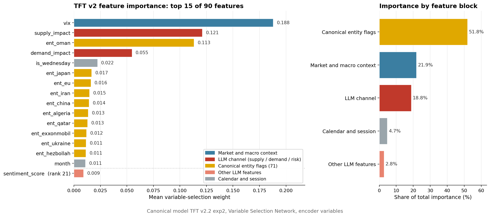
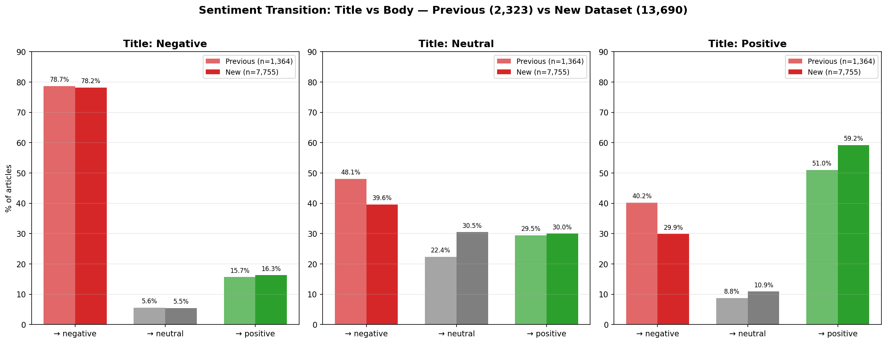

# News-Driven Liquidity Dynamics in WTI Crude Oil Futures

**A Channel-Decomposition Approach**

**Author:** Enrique Favila Martínez\
**Program:** MSc Artificial Intelligence & Cybersecurity, Radboud University\
**Host company:** Hammer Market Intelligence\
**Supervisor:** Prof. Dr. Lejla Batina · **Second reader:** Prof. Dr. Tom Heskes

---

## Project overview

News moves markets. The open question is _when_. Most media-sentiment research works at **daily** resolution, but the reaction to a release is concentrated within minutes to hours, and a daily bar averages that away. This project studies how news propagates into the **liquidity** of WTI crude oil futures at **hourly** resolution, along two axes:

- **RQ1 (lag structure):** at what delay does news sentiment most strongly move trading liquidity?
- **RQ2 (directional asymmetry):** does the liquidity response differ between bearish and bullish news?

Liquidity is measured hourly by **log trading volume** (activity), the **Amihud** illiquidity ratio (price impact), and the **Parkinson** high-low range (volatility).

### Headline results

| Finding                     | Result                                                                                                                                                                                                                                                                                  |
| --------------------------- | --------------------------------------------------------------------------------------------------------------------------------------------------------------------------------------------------------------------------------------------------------------------------------------- |
| **RQ1, lag structure**      | The response is **gradual, not contemporaneous**. It peaks at **+6h** (lag OLS) and is gone by +8h. TFT attention corroborates it independently: bearish-sentiment attention peaks at **−6h**.                                                                                          |
| **RQ2, asymmetry**          | Bearish sentiment carries a **larger marginal coefficient** than bullish at every dominant lag, by about **18%** at the peak. It does **not** appear as a difference in average predicted volume, because the model organizes around **risk and salience rather than price direction**. |
| **Forecasting**             | TFT v2 cuts `log_volume` error over a persistence baseline by **46 to 71%** across horizons, and `amihud` by **43 to 45%**.                                                                                                                                                             |
| **Cross-model calibration** | Decomposing sentiment into three channels lifted Haiku-vs-GPT-5 agreement on the composite score from **r = 0.39 to r = 0.88**, without the composite itself being modified.                                                                                                            |
| **News representation**     | Title-only and title-plus-body FinBERT sentiment disagree on **41.6%** of articles, and titles lean systematically more bullish than the bodies they head.                                                                                                                              |

> **Main finding.** The market does not trade more because the news sentiment is bad. It trades more because the news raises **uncertainty about supply**, and in the oil market that uncertainty is often, against intuition, bullish for price.

Cross-commodity propagation (Brent, natural gas) is left as future work, and the data notebooks are written to generalize by swapping the ticker and query configuration.

---

## Two-phase design

The same questions run through two independent methodologies, so the second **corroborates** the first rather than replacing it.

|          | **Phase 1** (interpretable baseline)         | **Phase 2** (expressive deep learning)       |
| -------- | -------------------------------------------- | -------------------------------------------- |
| Features | FinBERT 3-class sentiment                    | Haiku 4.5, Schema v2 channel decomposition   |
| Filter   | regex / keyword heuristic (`body_valid`)     | LLM-judged `usable` flag                     |
| Model    | contemporaneous and lag OLS                  | Temporal Fusion Transformer (TFT)            |
| Corpus   | 13,690 articles, Mar 2024 to Feb 2026        | 22,795 articles, Jan 2024 to May 2026        |
| Controls | none                                         | DXY, VIX                                     |
| Output   | primary statistical evidence for RQ1 and RQ2 | interpretable corroboration plus forecasting |

Everything is **database-first**: the notebooks read from and write to a single SQLite database (`01_data/wti_thesis.db`). CSVs are kept only as backups and restore points.

---

## 1. Crawler pipeline

News comes from the **GDELT 2.0 Document API** (article metadata: URL, source, publication time, title) across thematic queries aimed at WTI-relevant content. Phase 1 used 8 queries; Phase 2 added 5 more to cover geopolitical supply risk.

```text
Phase 1 queries                  Phase 2 additions
crude oil market                 Iran sanctions oil
OPEC production cut              Saudi Arabia oil production
oil supply demand                China oil demand
petroleum inventory              Russia oil exports
Brent crude price                oil supply disruption
oil inventory report
energy market outlook
crude oil WTI price
```

Bodies are then HTTP-fetched and parsed per URL (notebook `04_gdelt_scrapper`), resume-capable with a DB checkpoint every 50 articles. Failures cluster on paywalled domains, Cloudflare-protected sources, and JavaScript-rendered pages.

### The Phase 2 corpus funnel

| Stage                          |   Articles | Note                                               |
| ------------------------------ | ---------: | -------------------------------------------------- |
| Raw GDELT records              |     76,345 | 13 queries, Jan 2024 to May 2026                   |
| After dedup and English filter | **22,795** | the modeling-ready corpus (`articles`)             |
| Body successfully retrieved    |     19,619 | the other 3,176 are nulls, blocks, or fetch errors |
| LLM-judged `usable = 1`        |     11,675 | substantive, WTI-relevant content                  |
| `usable_strict = 1`            | **10,514** | the TFT v2 training filter                         |

`usable_strict` is defined as `usable = 1 AND (supply_impact != 0 OR demand_impact != 0 OR risk_premium != 0)`. It drops topical-but-channel-neutral articles. It is a **signal filter, not a correctness filter**.

### Temporal alignment: pinning news to trading hours

News publishes at any hour. Trading does not. Two rules keep the alignment causal:

- **Ceiling rule (`dt.ceil`, never `dt.round`).** An article published at 14:23 is assigned to the **15:00** bar, not 14:00, because the 14:00 bar was already forming before the news existed. This prevents look-ahead bias.
- **Forward-assignment.** Off-hours news (weekends, holidays) waits for the next reopen instead of being discarded.

**22.9%** of articles are forward-assigned, with a median publication-to-hour gap of 0.50h, p90 of 19.8h, and a maximum of 73.8h (a holiday weekend, the sane upper bound). The aligned hourly grid holds **11,232** trading hours.

> **Known defect, documented in the thesis (§5.3).** `merge_asof(direction='forward')` has no case for articles published _before_ the market grid starts, so 3,657 pre-grid articles all pile onto the first available row (`2024-05-13 12:00`). That hour is grid index 1, deep inside the training partition, so it never reaches validation or test and its impact on reported results is negligible. The correct fix is to drop pre-grid articles rather than forward-assign them. Note that the raw `assignment_gap > 1h` statistic is 35.3%, inflated by this pile-up; **22.9%** is the true forward-assigned share.

---

## 2. LLM feature extraction

Phase 2 replaces FinBERT's three classes with structured extraction by **Anthropic's Haiku 4.5** through the **Batches API**, using **forced tool-use** (`tool_choice`) so the schema is enforced at the API boundary: enumerated values for categoricals, type and range constraints on numerics, required-field validation.
The schema went through one iteration, driven by the calibration failure in section 3 below.

<table>
<tr><th>Schema v1</th><th>Schema v2 (canonical)</th></tr>
<tr><td>

```json
{
  "sentiment_score": 0.75,
  "magnitude": 0.85,
  "price_direction": "bullish",
  "event_type": "geopolitical",
  "certainty": 0.9,
  "time_horizon": "short_term",
  "entities": ["Russia", "US"]
}
```

</td><td>

```json
{
  "usable": true,
  "sentiment_score": 0.85,
  "supply_impact": -0.9,
  "demand_impact": 0.0,
  "risk_premium": 0.8,
  "magnitude": 0.85,
  "certainty": 0.9,
  "event_type": ["geopolitical", "supply"],
  "time_horizon": "short_term",
  "entities": ["United States"]
}
```

</td></tr>
</table>

What changed and why, on the example _"Russian Sanctions Drive Oil Prices Higher"_:

- **Three orthogonal channels added.** `supply_impact`, `demand_impact` and `risk_premium`, each in [−1, +1]. A supply threat is negative in valence but bullish for price; one composite number cannot hold both judgments.
- **`price_direction` dropped**, since it duplicated the judgment the channels now make explicit.
- **`event_type` became an ordered array** of one to three labels from a fixed set of six, ordered by salience.
- **`usable` became a required boolean**, replacing the Phase 1 regex filter. When the model marks an article unusable it may skip every other field, which cuts output tokens from roughly 200 to 10 on those articles (about a 90% saving).

**LLM-as-filter beats regex** on both of the regex's failure modes: long off-topic keyword matches, and short but substantive briefs.

**Entity normalization** (notebook `12`) collapses **5,807** raw LLM entity strings into **71 canonical entities** ("Tehran" and "Iranian" both map to `ent_iran`), stored long-format in `article_entities`.

---

## 3. Cross-model calibration

There is **no human-annotated ground truth** for this corpus. So validation uses **cross-model agreement**: the same 30 stratified articles, the same prompt and tool schema, scored by **Claude Haiku 4.5** and by **OpenAI GPT-5**, two models from different developer families.

**Schema v1 failed.** The two models agreed on the `usable` flag for 26 of 30 articles (87%), but agreement on the composite `sentiment_score` was a Pearson correlation of only **0.39**, with **opposite-signed** scores on 4 of 13 usable articles (31%).

**Where it broke is the interesting part.** The sign disagreements were not evenly spread. The two highest-magnitude articles in the sample, both geopolitical supply stories (an Iran escalation warning, the UAE announcing its exit from OPEC), disagreed on sign. Those are exactly the articles that move the market. The cause: the composite score was being asked to hold two separate judgments at once, the **valence of the event** (good news or bad news?) and its **directional price impact** (does it push crude up or down?). For most articles those agree. For a supply-threatening escalation they come apart.

**The fix, and the surprise.**

| Metric                        | v1 schema    | v2 schema       |
| ----------------------------- | ------------ | --------------- |
| `sentiment_score` correlation | 0.39         | **0.88**        |
| Sign disagreements            | 4 / 13 (31%) | **1 / 14 (7%)** |
| `supply_impact` correlation   | n/a          | 0.94            |
| `demand_impact` correlation   | n/a          | 0.96            |
| `risk_premium` correlation    | n/a          | 0.82            |

The composite improved from 0.39 to 0.88 **without being modified**. Asking the model to decompose the article first, and only then produce a composite, disciplines everything downstream. Within the calibration sample the channels are near-orthogonal (pairwise |r| ≤ 0.40). On the full corpus `demand_impact` is essentially uncorrelated with the others (|r| < 0.05), while `supply_impact` and `risk_premium` correlate at −0.55, which is economically expected since a supply threat is itself a risk event.

---

## 4. Transformer architecture

**Why a TFT.** Sparse, event-driven news with many features and several horizons needs more than a single-lag regression. The Temporal Fusion Transformer learns nonlinear interactions and, critically, **reports its own reasoning**: which inputs it weighted (Variable Selection Network) and which past hours it looked at (interpretable multi-head attention). That is exactly what the research questions need.

### Aggregating articles onto the hourly grid

| Feature kind                                | Aggregation                              |
| ------------------------------------------- | ---------------------------------------- |
| Continuous (channels, magnitude, certainty) | hour-averaged                            |
| Entity flags                                | maximum count                            |
| Categoricals (`event_type`, `time_horizon`) | taken from the highest-magnitude article |
| Hours with no news                          | flagged `no_news`                        |

`event_type` and `time_horizon` enter as **learned embeddings**, not integer codes. This is the pivotal fix of the ablation: integer encoding imposes a numeric order that means nothing and is what kept the channels from being predictive.

### Canonical configuration: TFT v2.2 exp2

|                     |                                                                    |
| ------------------- | ------------------------------------------------------------------ |
| Encoder window      | 48 hours                                                           |
| Targets             | `log_volume`, `amihud`, `price_range`                              |
| Horizons            | +1, +3, +6, +12h                                                   |
| Features            | 90 total (3 channels, 71 entity flags, market context, calendar)   |
| Hidden size / heads | 32 / 4                                                             |
| Dropout / seed      | 0.15 / 42                                                          |
| Parameters          | 298,329                                                            |
| Split               | 60 / 20 / 20 on 11,232 hours                                       |
| Corpus filter       | `usable_strict = 1`                                                |
| War onset           | inside the **test** set, so the regime break is unseen at training |

Selected through a three-variant ablation: **v2.0** (int-encoded) → **v2.1** (proper categoricals) → **v2.2** (multi-target plus entities). Adding EIA features (v2.3) made it worse, so v2.2 exp2 stays canonical.

---

## 5. Results

### RQ1 and RQ2, Phase 1: the response peaks at +6 hours


_Left: bearish `P(negative)` and bullish `P(positive)` coefficients on `log_volume` at lags 1, 2, 3, 4, 6, 8 and 12 hours. Stars mark significance at p < 0.05. Right: the corresponding p-values against the p = 0.05 reference line._

The effect builds from publication, **peaks sharply at +6h**, and is gone by +8h. Peak β = 0.342; volume is logged, so that is e^β − 1 ≈ **41% more volume** than a neutral hour. Bearish sits above bullish at 0, +1h, +4h and +6h, by about **18%** at the peak.

Two honest caveats. R² never exceeds 0.003, which is expected: hourly volume has many drivers and sentiment is one of them, so this measures sentiment's share of _total_ volume variance, not of news-driven volume. **The finding is the shape across lags, not the explained variance.** And the bearish-versus-bullish ordering is reported as a consistent ordering; the difference between the two coefficients is not itself submitted to an equality test.

### RQ1, Phase 2: where in time the model looks


_Mean encoder attention across the 48-hour window, disaggregated by sentiment direction._

Overall attention peaks at **−1h**, and bullish-sentiment hours peak at −1h too. **Bearish-sentiment hours peak at −6h**, matching the Phase 1 lag OLS under a method that shares none of its assumptions. This is the independent corroboration for RQ1, and it is also the Phase 2 evidence for RQ2: the asymmetry shows up as a **temporal** difference rather than a level difference.

### What the model leans on



_Left: the top 15 of 90 features by mean variable-selection weight, with `sentiment_score` shown for reference at rank 21. Right: share of total importance by feature block._

- **Entities carry the block.** All 71 flags together hold about **52%** of total importance, and six sit in the top ten.
- **Only four features lead individually.** VIX (0.188), `supply_impact` (0.121), `ent_oman` (0.113), `demand_impact` (0.055). Everything from rank 5 down is ≤ 0.022.
- **The channels rival VIX.** Supply plus demand carry 17.6% of raw weight, against 18.8% for VIX alone.
- **Wednesday matters** (`is_wednesday`, rank 5): EIA inventory release day.
- **The composite sinks to 21st** (0.009), down from carrying 53% of the weight in TFT v1. Decomposing sentiment is what surfaced the features that actually matter.

_Exact ranks shift on retraining. What is stable is the feature **type**: risk and salience over price direction._

### Forecasting performance against a persistence baseline

Hourly volume is strongly autocorrelated, so "assume nothing changes" is already a good forecast. Beating it means the model learned more than inertia. Median quantile (q50) MAE on the held-out test set.

**`log_volume`** (primary target)

| Horizon | Persistence MAE | TFT v2 MAE | Reduction | Pre-war MAE | War MAE |
| ------: | --------------: | ---------: | --------: | ----------: | ------: |
|      1h |           1.076 |      0.585 |   **46%** |       0.536 |   0.628 |
|      3h |           1.452 |      0.577 |   **60%** |       0.537 |   0.611 |
|      6h |           1.820 |      0.602 |   **67%** |       0.551 |   0.646 |
|     12h |           2.174 |      0.631 |   **71%** |       0.568 |   0.685 |

**`amihud`** (price impact)

| Horizon | Persistence MAE | TFT v2 MAE | Reduction |
| ------: | --------------: | ---------: | --------: |
|      1h |          0.0004 |    0.00023 |   **43%** |
|      3h |          0.0004 |    0.00023 |   **43%** |
|      6h |          0.0004 |    0.00022 |   **45%** |
|     12h |          0.0004 |    0.00022 |   **45%** |

**`price_range`** (volatility, the failure case)

| Horizon | Persistence MAE | TFT v2 MAE | Reduction | Pre-war MAE | War MAE |
| ------: | --------------: | ---------: | --------: | ----------: | ------: |
|      1h |           0.495 |      0.718 |      −45% |       0.154 |   1.200 |
|      3h |           0.578 |      0.719 |      −24% |       0.156 |   1.200 |
|      6h |           0.630 |      0.721 |      −14% |       0.161 |   1.198 |
|     12h |           0.701 |      0.724 |       −3% |       0.165 |   1.201 |

**Works.** Volume and Amihud beat persistence at every horizon.

**Fails, and cleanly.** `price_range` loses on the full test set, but the failure is **regime-specific, not general**. On the pre-war slice the model does well (0.154 to 0.165, beating persistence). On the war slice it degrades to about 1.200. Having only ever seen the moderate-volatility pre-war regime, the model reverts toward the historical mean while persistence at least tracks the elevated current state. This is a textbook **regime-extrapolation failure**, and it makes sense that it surfaces on `price_range`, which measures intraday volatility directly and is therefore the most regime-sensitive of the three targets.

**One diagnostic is weaker than it looks.** The `log_volume` reduction curve grows from 46% at +1h to 71% at +12h, but that is mostly the _baseline_ decaying (persistence MAE rises 1.076 → 2.174) rather than the model improving (0.585 → 0.631). Read strictly, this curve establishes that the Phase 2 features carry signal across the whole 1-to-12h window; it does **not** locate the response at any particular lag. The lag evidence comes from the attention pattern.

### Supporting finding: headline bias



_Where each title-only label ends up once the body is read (7,755 articles with a body)._

| Title label      |  → positive | → neutral |    → negative |
| ---------------- | ----------: | --------: | ------------: |
| positive (2,427) | 1,437 (59%) | 264 (11%) | **726 (30%)** |
| neutral (2,257)  |   676 (30%) | 688 (31%) | **893 (40%)** |
| negative (3,071) |   500 (16%) |  169 (6%) |   2,402 (78%) |

**3,228 articles (41.6%) change label**, and the movement is one-directional: positive and neutral titles leak into negative far more than negative titles leak out. Label flips carry a mean divergence magnitude of 0.96, close to a full reversal. **A headline reads more positive than the article it introduces**, which makes the choice of news representation a modeling decision in its own right.

---

## Conclusions

**On RQ1.** News hits WTI liquidity hardest not in the same hour but roughly **six hours later**. Two independent methods agree: the Phase 1 lag OLS peaks at +6h, and the Phase 2 TFT, trained and evaluated separately on a different corpus with different features, attends to −6h for bearish news. The response is **gradual rather than instantaneous**, and daily-frequency work cannot see this structure at all.

**On RQ2.** The answer depends on how the question is asked, and stating it precisely is as much the contribution as the result. Bearish sentiment carries a consistently larger **marginal coefficient** than bullish across the dominant lags. It does **not** survive as a difference in the **average level** of predicted volume. These are two different estimands, not a failed replication. Two things explain the gap: the model organizes forecasts around the risk and salience a news item carries rather than its price direction, and a tone-based and a price-based sentiment measure disagree on exactly the geopolitical news that moves the market.

**Methodological contributions.**

- **Temporal alignment** of continuous news onto a discontinuous trading grid: a causally conservative ceiling rule plus forward-assignment, the prerequisite for any intraday design.
- **Channel decomposition** as a higher-resolution feature set and, through cross-model agreement, a defensible validation substrate where no human ground truth exists.
- **The tone-versus-price distinction**: a sentiment measure is defined by its construct, and a tone classifier and a price-reasoning LLM part ways on exactly the news that drives volume.
- **LLM-as-filter** as a semantically grounded alternative to regex heuristics for noisy web-scraped corpora.
- **A two-phase template** pairing an interpretable statistical baseline with an expressive deep-learning model that corroborates it rather than replacing it.

### Limitations

- **No human ground truth.** Validation rests on model agreement over a 30-article sample.
- **`price_range` breaks at the regime boundary**, a clean regime-extrapolation failure.
- **Narrow scope.** One commodity, two years, one structural break.
- **Public web corpus**, not the institutional feeds traders actually read.

### Future work

- An **expert anchor set** of roughly 200 articles, to calibrate the calibration.
- **Carry both sentiments** in parallel, tone and price impact; their disagreement may itself be signal.
- **Multi-regime training**, so volatility targets survive a structural break.
- **Cross-commodity replication**, starting with natural gas.

---

## Repository structure

```text
news-driven-liquidity/
├── 01_data/
│   ├── wti_thesis.db            # canonical SQLite database (single source of truth)
│   ├── raw/
│   │   ├── price/               # wti_hourly_raw.csv (yfinance OHLCV)
│   │   ├── macro/               # eia_inventories_raw.csv
│   │   └── news/                # gdelt_wti_raw.csv, gdelt_wti_with_body_raw.csv
│   ├── processed/               # gdelt_wti_aligned.csv, market_context.csv
│   ├── features/                # gdelt_wti_sentiment.csv (FinBERT), headline_bias_summary.csv
│   └── models/                  # tft_wti.ckpt, training_dataset.pkl (TFT v1)
├── 02_notebooks/                # the numbered pipeline, 00 -> 13 (see below)
│   └── deprecated_notebooks/    # superseded exploration
├── 03_src/
│   ├── nlp/llm_features.py      # locked prompt, tool schema, entity maps, canonicalize_entities
│   └── tft/config.py            # locked constants (TRAIN_END, WAR_ONSET_IDX, ...)
├── 04_outputs/
│   ├── figures/                 # generated PNGs (lag coefficients, attention, importance...)
│   ├── tables/                  # generated CSVs (lag OLS results...)
│   ├── calibration/             # llm_calibration_v2.json, human_calibration_v2.json
│   └── experiment_tracking/     # TFT v1 and v2 checkpoints, per-variant run outputs
└── 05_reports/
    ├── thesis/                  # LaTeX thesis (thesis.tex, sections/, references.bib, figures/)
    ├── presentation-thesis/     # defense.md (Marp deck) + exported pptx/pdf/html
    ├── presentation-hammer/     # host-company deck
    ├── development-decisions/   # project_logbook.md, thesis_decisions_log.md
    └── future-work/
```

### The database (`wti_thesis.db`)

Core tables created in notebook 00: `articles`, `liquidity`, `llm_features`, `market_context`, `opec_events`, `eia_events`. Later notebooks add `calibration_sample` (the 30-article sample), `raw_entity_counts`, and `article_entities`.

---

## What each notebook does

Run in numeric order; each builds on the tables the previous ones wrote.

| #   | Notebook                     | What it does                                                                                                                                                                                                                                           |
| --- | ---------------------------- | ------------------------------------------------------------------------------------------------------------------------------------------------------------------------------------------------------------------------------------------------------ |
| 00  | `setup_database`             | Creates the SQLite database and its six core tables, migrates the pre-aligned Phase 1 CSVs, and attaches the EIA features. The CSV migrations are optional, so the notebook does not break when adapting it to a new commodity with no local CSVs.     |
| 01  | `yfinances_prices`           | Downloads two years of hourly WTI futures prices (`CL=F`) from Yahoo Finance, plus DXY and VIX, and computes the four liquidity metrics into `market_context`. Change the ticker map to retarget another commodity.                                    |
| 02  | `eia_inventories`            | Downloads the weekly EIA crude inventory series, computes the week-on-week surprise, timestamps each Wednesday release, and merges `eia_surprise` / `is_eia_release` onto the hourly grid.                                                             |
| 03  | `gdelt_headlines`            | Queries GDELT for oil-news headlines (metadata only), deduplicates, keeps English, and appends new rows to `articles`. Incremental and safe to re-run.                                                                                                 |
| 04  | `gdelt_scrapper`             | Scrapes the body text for each headline URL, cleans it, and validates it (the `body_valid` flag). Resume-capable, with a DB checkpoint every 50 articles.                                                                                              |
| 05  | `alignment`                  | Assigns each article to its next available trading hour (causal, never before publication), joins the market snapshot and LLM features, and writes the `liquidity` table with hard consistency assertions.                                             |
| 06  | `llm_features`               | The full LLM extraction. Sends every article body to Claude Haiku through the Batches API, forcing the Schema v2 tool (the `usable` flag, composite sentiment, the three supply/demand/risk channels, entities), and writes `llm_features`. Resumable. |
| 07  | `headline_bias`              | Statistical test of title-only vs title+body FinBERT sentiment (the 41.6% divergence finding), motivating title+body as the primary sentiment input.                                                                                                   |
| 08  | `lag_and_asymmetry_analysis` | **Phase 1 core.** Contemporaneous and lag OLS of FinBERT sentiment on `log_volume`, producing the +6h peak (RQ1) and the bearish-over-bullish asymmetry (RQ2). Includes an exploratory VAR that was dropped from the thesis.                           |
| 09  | `parallel_features`          | Trains **TFT v1** (single target, one hour ahead) to validate that a deep-learning sequence model beats the OLS / persistence baseline.                                                                                                                |
| 10  | `tft_analysis`               | Interpretability of TFT v1: attention over the 48-hour window (RQ1, lag), Variable Selection Network importance, and a bearish-vs-bullish comparison (RQ2, asymmetry).                                                                                 |
| 11  | `calibration`                | One-shot Schema v2 calibration on a stratified 30-article sample; produces the Haiku side of the inter-model agreement check (the GPT reference is scored separately).                                                                                 |
| 12  | `entity_normalization`       | Normalizes the 5,807 raw LLM entity strings down to 71 canonical entities and builds the long-format `article_entities` table.                                                                                                                         |
| 13  | `tft_v2_training` / `_colab` | **The canonical model.** Trains **TFT v2** (three targets: log_volume, amihud, price_range; four horizons: 1/3/6/12h; channels plus 71 entity flags) on Google Colab, producing the reported results, feature importance, and attention figures.       |

> The FinBERT sentiment used by notebooks 07 and 08 comes from an earlier sentiment-scoring step (see `deprecated_notebooks/`) and is stored in `01_data/features/gdelt_wti_sentiment.csv`.

---

## Data sources

| Source                                | Data                                        | Frequency  |
| ------------------------------------- | ------------------------------------------- | ---------- |
| yfinance (`CL=F`, `DX-Y.NYB`, `^VIX`) | WTI OHLCV, plus DXY and VIX                 | Hourly     |
| EIA API (`WCRSTUS1`)                  | U.S. commercial crude oil inventories       | Weekly     |
| GDELT Project                         | News article metadata (energy, geopolitics) | Continuous |

## Liquidity variables

| Variable      | Definition                                    | Role                              |
| ------------- | --------------------------------------------- | --------------------------------- |
| `log_volume`  | Log-transformed hourly trading volume         | primary liquidity target          |
| `amihud`      | Absolute return / volume (Amihud, 2002)       | price-impact target               |
| `price_range` | ln(high) − ln(low) per hour (Parkinson proxy) | volatility target                 |
| `log_return`  | ln(close*t / close*{t-1})                     | price variable, input to `amihud` |

---

## Reproducing the pipeline

1. Create a Python environment (a local `.venv` is used) and install the dependencies (pandas, numpy, yfinance, requests, beautifulsoup4, anthropic, python-dotenv, statsmodels, scipy, matplotlib, seaborn, torch, lightning, pytorch-forecasting, transformers for FinBERT).
2. Put an `ANTHROPIC_API_KEY` in a `.env` file at the project root (needed for notebooks 06 and 11). An EIA API key is optional (notebook 02 falls back to `DEMO_KEY`, which is rate-limited).
3. Run the notebooks in order (00 -> 13). Notebook 13 (TFT v2) is intended for Google Colab with a GPU.

Two conventions worth knowing before you touch the code: use `lightning.pytorch`, never the legacy `pytorch_lightning` namespace (mixing them causes silent `isinstance` failures), and use `dt.ceil`, never `dt.round`, when aligning articles to trading hours.

---

## Outputs

- **Thesis:** `05_reports/thesis/` (LaTeX, self-contained for Overleaf).
- **Defense deck:** `05_reports/presentation-thesis/defense.md` (Marp), exported to `defense.{pptx,pdf,html}`.
- **Figures and tables:** `04_outputs/`.

---

## Key references

- Amihud, Y. (2002). Illiquidity and stock returns. _Journal of Financial Markets_.
- Araci, D. (2019). FinBERT: Financial sentiment analysis with pre-trained language models. _arXiv:1908.10063_.
- Gilardi, F., Alizadeh, M., & Kubli, M. (2023). ChatGPT outperforms crowd workers for text-annotation tasks. _PNAS_.
- Kilian, L. (2009). Not all oil price shocks are alike. _American Economic Review_.
- Leetaru, K., & Schrodt, P. A. (2013). GDELT: Global data on events, location and tone. _ISA Annual Convention_.
- Lim, B., et al. (2021). Temporal Fusion Transformers for interpretable multi-horizon time series forecasting. _International Journal of Forecasting_.
- Parkinson, M. (1980). The extreme value method for estimating the variance of the rate of return. _Journal of Business_.
- Tetlock, P. C. (2007). Giving content to investor sentiment. _The Journal of Finance_.
- Zheng, L., et al. (2023). Judging LLM-as-a-judge with MT-Bench and Chatbot Arena. _NeurIPS_.
